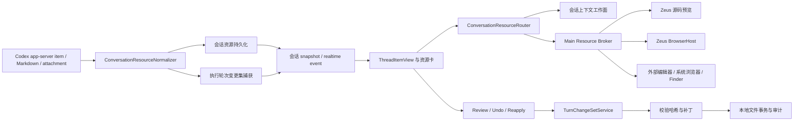
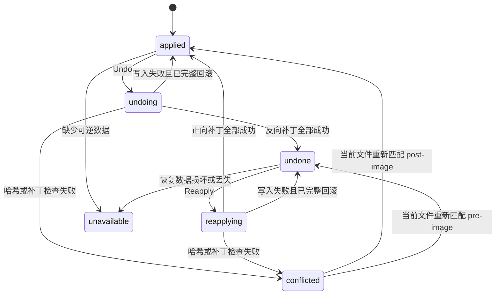

# TASK_20260727_001 Codex 会话资源打开能力完全对齐设计

## 0. 文档状态

- 用户确认时间：2026-07-27；
- 用户确认范围：文件引用、精确行跳转、HTTPS 链接、网站与附件资源卡、打开方式菜单、Zeus 内置浏览器、轮次变更摘要卡、Review、Undo、Reapply 全部包含；
- 当前阶段：`IMPLEMENTED; USER-REPORTED UI GAPS FIXED AND PACKAGED VERIFIED; HIGH-CONTRAST OS ROW STILL PENDING`；
- 产品、领域、协议、安全、持久化和交互实现已经落入生产代码；用户在正式包复核中补充指出的右侧分栏边界、设置页主题即时预览和蓝色线框问题，均已在重新打包后的正式 Zeus 中完成真实界面复测；
- 核心 post-fix GUI 的真实轮次、Review、Undo、Reapply、冲突与 Codex 参考视觉对比已经完成；扩展实机验收又发现并修复 Tab 焦点跳转、深色 portal 菜单文字和净零变化卡问题；
- 最新正式包已经重建并签名校验通过；深色菜单、Tab / Shift+Tab、完整键盘路径、浏览器中性分隔线、主题即时重绘和中性 focus-visible 已在该正式包中复测通过，目前全量矩阵仅剩 macOS high contrast 真实环境验收。

## 1. 原始目标

在 Zeus 现有会话页中，不新增另一套视觉语言，复现当前 Codex App 的文件引用、资源卡、打开目标和轮次变更卡体验。用户应能从一条模型回复直接抵达：

1. 正确的项目文件与源码行；
2. Zeus 内置浏览器中的正确网页；
3. 系统浏览器或其他可用打开目标；
4. 会话附件或模型生成的本地文档；
5. 当前执行轮次真实产生的文件变更；
6. 该轮次变更的 Review 工作区；
7. 可解释、可冲突检测、可恢复的 Undo / Reapply。

“100% 对齐”以当前 Codex App 的可观察行为、用户提供的截图和当前安装版本的只读取证为准。Zeus 不复制 Codex 专有源码、私有 token 或未授权资产；内部实现使用 Zeus 自己的类型、服务和安全边界。

## 2. 已确认的参考证据

### 2.1 用户截图

- `/var/folders/2m/dswmfzbd7wx_39zxs4kvd3fc0000gn/T/codex-clipboard-52194000-7270-4d35-946a-7e2642478f6a.png`
  - Java、JavaScript、SQL 文件引用带文件类型图标；
  - 标签显示文件名和 `(line N)`；
  - 文件引用与普通正文处于同一行内排版。
- `/var/folders/2m/dswmfzbd7wx_39zxs4kvd3fc0000gn/T/codex-clipboard-fb9a45a9-5645-4bce-b586-e4fadbcdcb1a.png`
  - 普通 GitHub 链接仍是行内链接；
  - 本地交付文件使用可打开的文件引用；
  - 网站资源以独立资源卡呈现，并带“打开方式”；
  - 文件变更以“已编辑 N 个文件”、增删行统计、文件列表、Review、Undo / Reapply 呈现。

### 2.2 当前 Codex App

本机当前安装：

- 版本：`26.721.41059`；
- build：`5848`；
- bundle id：`com.openai.codex`。

对 `/Applications/Codex.app` 的只读检查确认了以下可观察语义：

- 文件引用携带 `path / line / column / endLine`；
- 文件引用根据扩展名显示不同图标，并提供完整路径提示；
- 文件打开目标可以是内置文件视图、已检测应用、文件管理器或自定义处理器；
- 普通链接和本地 URL 分别保存“应用内浏览器 / 外部浏览器”偏好；
- 网站资源卡的主操作和“打开方式”菜单相互独立；
- 轮次变更卡只在确有变更时出现；
- 多文件默认展示有限文件行，剩余文件通过“再显示 N 个文件”展开；
- 卡片支持 Review、Undo 和 Reapply；
- Undo / Reapply 基于该轮次的补丁，而不是 `git reset`、`git revert` 或当前工作区的笼统 diff；
- Review 从会话进入侧边审核工作区，不替换或丢失原会话。

只读取证目录为 `/tmp/codex-app-inspect-20260727`，不进入仓库、不作为 Zeus 运行依赖。

### 2.3 OpenAI 官方配置事实

当前官方 Codex 配置参考确认：

- `file_opener` 控制文件引用使用的打开 URI；
- 支持 `vscode`、`vscode-insiders`、`windsurf`、`cursor`、`none`；
- `desktop.custom_file_handlers.*` 可以增加自定义“Open in”目标。

参考：

- https://learn.chatgpt.com/docs/config-file/config-reference#configtoml

### 2.4 Zeus 当前代码事实

| 位置 | 当前事实 | 与目标的差距 |
| --- | --- | --- |
| `apps/desktop/src/renderer/session/ThreadItemView.tsx` | 只用正则处理简单 Markdown；仅把 `http(s)` / `mailto` 视为安全链接；链接使用原生 `<a target="_blank">` | 主窗口禁止 `window.open`，所以蓝色 HTTPS 链接实际打不开；本地文件路径被降级为普通文本 |
| `apps/desktop/src/main/main.ts` | 主窗口拒绝所有 `window.open` 和外部导航；已有 `zeus:open-external-https-url` | 安全桥存在，但会话链接没有调用 |
| `apps/desktop/src/main/sourceOpen.ts` | 能校验项目根目录并调用 `shell.openPath` | 返回 `lineStart` 但没有精确跳到源码行 |
| `apps/desktop/src/renderer/session/SessionActivity.tsx` | `fileChange` 只是“变更文件”的活动文本 | 没有轮次变更卡、Review、Undo / Reapply |
| `apps/desktop/src/renderer/session/sessionTypes.ts` | `NativeItemSnapshot.payload` 保留原始对象 | 已具备接收 `fileChange.changes` 和资源元数据的基础 |
| `packages/local-server/src/codexNativeConversationCoordinator.ts` | 持久化并回放 item 原始 payload；识别 `fileChange`；文件审批已读取 `changes[].path` | 尚未把 item 转换为会话资源或持久轮次变更集 |
| `apps/desktop/src/main/browserHost.ts` | `open-tab` 已支持 `{ conversationId, url }` | 可以直接承接网站资源的“在 Zeus 中打开”，但会话资源尚未接线 |
| `packages/local-server/src/index.ts` | 已有项目、任务和全局 Git diff | 这些都是当前工作区 diff，不是某一次执行轮次的精确变更 |
| `apps/desktop/src/renderer/App.tsx` | 已有 Git diff 文件、hunk 和审核界面基础 | 当前审核是项目级工作区，且现有 hunk 选择不执行补丁；不能直接冒充轮次 Undo |
| 任务附件 IPC | 已有受信附件根目录、预览和系统打开 | transcript 中的附件列表尚未接入 |

## 3. 需求质疑后的关键结论

### 3.1 这不是“链接点击修复”

若只把 `<a>` 改成 `shell.openExternal`，只能修复一小部分 HTTPS 链接，还会遗留：

- 本地路径和行号无法解析；
- 文件打开目标不能选择；
- 附件没有权限边界；
- 资源卡与普通链接混在一起；
- Review 使用错误的全局 diff；
- Undo 可能覆盖轮次结束后的用户修改。

因此本功能的正式名称是**会话资源打开链路**，不是“链接点击”。

### 3.2 普通 Markdown 链接不能直接成为本地文件权限

模型文本、网页标题、文件标签和 provider payload 都是不可信输入。Renderer 只能展示资源意图，不能凭一个 `href` 获得任意本地文件权限。

所有文件打开必须经过：

1. 会话与项目归属解析；
2. 路径规范化；
3. 项目根或受信附件根包含性校验；
4. 符号链接逃逸校验；
5. 文件存在性和类型校验；
6. Main 进程受信发送方校验；
7. 打开目标能力校验。

### 3.3 当前工作区 diff 不能冒充轮次变更

`/api/projects/:projectId/git/diff` 和 `/api/tasks/:taskId/diff` 都读取调用时的整个工作区。若用户在同一项目中继续编辑，或者另一个会话产生修改，这些接口无法回答“这一轮模型到底改了什么”。

Review、Undo 和 Reapply 必须基于持久化的**执行轮次变更集**。

### 3.4 Undo 不能等于 Git 历史操作

本功能中的 Undo：

- 不创建 commit；
- 不执行 `git reset`；
- 不执行 `git revert`；
- 不切换分支；
- 不覆盖未通过前置哈希校验的文件；
- 只反向应用当前轮次的可恢复变更；
- 成功后提供 Reapply。

### 3.5 浏览器、计划、审核和源码预览不能同时抢占右侧

当前会话已有浏览器右侧分栏和计划工作区。继续分别添加 Review、源码预览会产生多套互相覆盖的状态。

设计采用一个统一的**会话上下文工作面**，其内容类型为：

- `browser`；
- `plan`；
- `source`；
- `turn_diff`；
- `none`。

同一时刻只显示一个右侧上下文工作面。切换内容不销毁会话记录和 composer。

## 4. 目标领域模型

### 4.1 类型化会话资源

```ts
type ConversationResource =
  | ConversationFileResource
  | ConversationWebsiteResource
  | ConversationAttachmentResource
  | ConversationTurnDiffResource;

interface ConversationResourceAuthority {
  resourceId: string;
  projectId: string;
  conversationId: string;
  turnId: string;
  sourceItemIds: string[];
  createdAt: string;
}

interface ConversationFileLocation {
  line?: number;
  column?: number;
  endLine?: number;
}

interface ConversationFileResource extends ConversationResourceAuthority {
  kind: 'file';
  presentation: 'inline' | 'card';
  displayName: string;
  projectRelativePath: string;
  location?: ConversationFileLocation;
  mimeType?: string;
  iconKind: ConversationFileIconKind;
}

interface ConversationWebsiteResource extends ConversationResourceAuthority {
  kind: 'website';
  presentation: 'inline' | 'card';
  url: string;
  title?: string;
  domain: string;
  favicon?: TrustedResourceImage;
  local: boolean;
}

interface ConversationAttachmentResource extends ConversationResourceAuthority {
  kind: 'attachment';
  presentation: 'inline' | 'card';
  displayName: string;
  attachmentRef: string;
  mimeType?: string;
  previewKind: 'image' | 'document' | 'none';
}

interface ConversationTurnDiffResource extends ConversationResourceAuthority {
  kind: 'turn_diff';
  presentation: 'card';
  changeSetId: string;
  fileCount: number;
  addedLines: number;
  deletedLines: number;
  state: TurnChangeSetState;
}
```

关键约束：

- Renderer 接收 `resourceId` 和展示字段，不接收可直接绕过校验的任意打开权限；
- 绝对路径只在受信服务内部存在，UI 默认显示项目相对路径或文件名；
- `presentation` 决定行内引用还是资源卡，不能把所有 URL 自动升级成大卡片；
- 同一目标在同一 item 中使用稳定资源 ID，流式更新时不重复创建。

### 4.2 执行轮次变更集

```ts
type TurnChangeSetState =
  | 'applied'
  | 'undoing'
  | 'undone'
  | 'reapplying'
  | 'conflicted'
  | 'unavailable';

interface TurnChangeSet {
  id: string;
  projectId: string;
  conversationId: string;
  turnId: string;
  providerTurnId: string;
  state: TurnChangeSetState;
  files: TurnChangeFile[];
  forwardPatchBatches: PatchBatch[];
  preImageDigest: string;
  postImageDigest: string;
  conflict?: TurnChangeConflict;
  createdAt: string;
  updatedAt: string;
}
```

每个 `TurnChangeFile` 至少保存：

- 变更前路径和变更后路径；
- `added / deleted / modified / renamed / copied / binary`；
- 增删行数；
- 变更前、变更后内容哈希；
- 可展示的统一 diff；
- 可逆所需的文本或 blob 引用；
- 是否允许 Undo / Reapply；
- 不可逆时的明确原因。

### 4.3 变更捕获时点

轮次变更不能在 `turn/completed` 时才用一次全局 Git diff 猜测。捕获顺序固定为：

1. `fileChange` item 首次 started 或申请文件审批时，解析目标路径并在 provider 写入前保存 pre-image、路径状态和哈希；
2. `fileChange` item completed 时保存 provider patch、post-image 和哈希；
3. 同一轮次的多个 fileChange item 按 provider 顺序组成 patch batches，每个 batch 保留项目内的 cwd / Git root 归属；
4. `turn/completed` 时聚合、去重并 seal 变更集；
5. 若事件顺序未提供可验证 pre-image，则只在 provider patch 足以无歧义重建 pre-image 时允许 Undo；
6. 无法证明变更前后状态时仍可展示已知 Review，但把 Undo 标记为 `unavailable`。

禁止在轮次完成时对整个项目做一次前后不明的 diff，并把并发用户修改或其他会话修改归因给当前轮次。

## 5. 端到端架构



### 5.1 职责分层

| 层 | 职责 | 禁止事项 |
| --- | --- | --- |
| provider adapter / coordinator | 保存原始 item，触发资源归一化和轮次变更集捕获 | 不直接调用系统应用 |
| local-server domain service | 解析会话、项目、资源、变更集和权限；提供持久快照 | 不信任 Renderer 传来的绝对路径 |
| Renderer | 展示、选择打开目标、管理右侧工作面和反馈状态 | 不直接执行文件系统或 shell 操作 |
| Main Resource Broker | 复验发送窗口、解析受信资源、调用 BrowserHost / shell / editor URI | 不接受未经归属解析的任意路径或 URL |
| TurnChangeSetService | Review 数据、Undo / Reapply 检查、事务、审计 | 不使用当前全局 Git diff 替代轮次补丁 |

## 6. 资源归一化规则

### 6.1 输入来源

按优先级处理：

1. app-server item 中明确的资源或 artifact 元数据；
2. `fileChange` item 的 `changes[]`；
3. 用户和 assistant item 的附件；
4. Markdown 链接；
5. 已知的模型生成资源。

不对普通正文中的任意“看起来像路径”的字符串做全局正则点击化，避免误判命令、日志、SQL 和示例文本。

### 6.2 文件引用语法

支持当前 Codex 输出常见的结构化或 Markdown 表达：

- 绝对路径：`/absolute/path/File.ts:71`；
- `file:///absolute/path/File.ts#L71`；
- 项目相对路径：`apps/desktop/src/main/main.ts:501`；
- 行范围：`#L71-L84` 或受信资源元数据中的 `line / endLine`；
- 列：只接受受信元数据或明确的 `line:column` 形式。

解析顺序必须避免把文件名中的冒号、URL 端口和 Windows 盘符误判为行号。当前 macOS 实现先覆盖 POSIX；类型设计保留 Windows 路径适配能力。

### 6.3 网站资源

- 允许 `https:`；
- 允许 Zeus BrowserHost 支持的 `http:`，但外部打开仍遵循安全策略；
- `mailto:` 只允许交给系统处理，不进入 Zeus 浏览器，也不生成网站资源卡；
- 允许 `localhost`、`127.0.0.1`、`::1` 的本地 URL；
- `file:` 只允许经过项目或受信附件根解析的本地 HTML，不按普通网站 URL 放行；
- 拒绝带用户名或密码的 URL；
- 拒绝 `javascript:`、`data:`、`vbscript:` 和未知 scheme；
- URL title、favicon 和页面正文都视为不可信展示数据；
- 不得为了生成卡片而后台盲目请求任意 URL。title 和 favicon 只来自 provider 已给元数据、已打开的 BrowserHost 快照或受信本地文件。

### 6.4 附件资源

- 任务附件、会话附件、页面批注截图和模型生成文件分别保留来源类型；
- 只能从 Main 已登记的附件根或项目根解析；
- 图片可以在 Zeus 内预览；
- 文档首版使用系统应用或可用自定义处理器打开；
- 未知类型提供 Finder 定位和复制路径，不假装已经具备内容预览器；
- 附件不存在时保持原消息和文件名，动作变为不可用并解释原因。

## 7. 打开目标与路由

### 7.1 统一打开目标

```ts
type ConversationOpenTarget =
  | 'zeus_source'
  | 'zeus_browser'
  | 'system_default'
  | 'file_manager'
  | 'copy_link'
  | 'copy_path'
  | `custom:${string}`;
```

菜单只展示当前资源实际可用的目标：

| 资源 | 主操作 | “打开方式”候选 |
| --- | --- | --- |
| 带行号源码文件 | 用户文件偏好；无偏好时 Zeus 源码预览 | Zeus 源码预览、已检测编辑器、Finder、复制路径 |
| 普通本地文件 | 用户文件偏好；无偏好时系统默认 | 已检测应用、系统默认、Finder、复制路径 |
| 本地 HTML | 本地 URL 偏好 | Zeus 浏览器、外部浏览器、Finder、复制路径 |
| HTTPS 网站 | 普通链接偏好 | Zeus 浏览器、外部浏览器、复制链接 |
| 图片附件 | Zeus 预览 | 系统默认、Finder、复制路径 |
| 文档附件 | 用户文件偏好 | 可用应用、系统默认、Finder、复制路径 |
| 轮次变更集 | Review | Review、逐文件打开；Undo / Reapply 是独立动作 |

### 7.2 偏好

与当前 Codex 可观察设置对齐，但使用 Zeus 自己的文案和存储：

- 普通网页默认：`Zeus 内置浏览器 / 外部浏览器`；
- 本地网页默认：`Zeus 内置浏览器 / 外部浏览器`；
- 文件默认打开目标：全局默认；
- 路径或文件类型覆盖：只有用户主动选择“以后对这类文件使用”时保存；
- 自定义文件处理器：支持 label、icon、command、args、输入方式和是否支持远程路径；
- “打开方式”中的一次性选择默认不改变偏好。

### 7.3 精确源码位置

- Zeus 源码预览必须滚动到 `line`，高亮 `line..endLine`，并在标题中显示项目相对路径；
- 外部编辑器 adapter 只有声明支持 `line / column` 时才显示“精确到行”能力；
- `shell.openPath` 只能打开文件，不能假装已经跳到行；
- URI 构造和参数转义由 Main 中的目标 adapter 完成，Renderer 不拼装 `vscode://`、`cursor://` 等 URI；
- 文件缺失、位置越界或 handler 不可用时给出局部错误，不能静默打开错误位置。

### 7.4 Zeus 内置浏览器

网站资源选择 `zeus_browser` 时：

1. 保留当前会话记录和 composer；
2. 将会话上下文工作面切换为 `browser`；
3. 调用现有 `openBrowserTab({ conversationId, url })`；
4. URL 在当前会话拥有独立标签；
5. 使用现有 `0 → 1` 宽度与透明度动画；
6. 最后一个标签关闭时继续沿用“关闭右侧浏览器”的既有语义。

## 8. 会话内容视觉与交互规格

### 8.1 行内文件引用

- 文件类型图标、文件名和位置标签作为一个语义按钮；
- 位置标签使用 `(line N)`、`(lines N–M)`；中文界面仍保留当前 Codex 截图中的源码位置表达，不翻译真实文件名；
- 默认只显示 basename，完整项目相对路径放入 tooltip / accessible description；
- hover 使用细下划线或等价低噪音反馈，不绘制大胶囊背景；
- `Enter / Space` 执行主打开动作；
- 上下文菜单或尾部菜单提供“打开方式”；
- 打开中使用 `aria-busy`，重复点击不并发；
- 缺失、越界、越权和 handler 不可用分别显示可理解的错误。

### 8.2 普通网页链接

- GitHub 等普通引用保持行内链接，不自动变成资源卡；
- 点击不再依赖 `<a target="_blank">`；
- 所有点击进入 `ConversationResourceRouter`；
- modifier 键行为以当前 Codex 实际验收为准，不能由浏览器默认行为偷偷创建 Electron 窗口；
- 焦点、hover、visited 不只依赖颜色区分。

### 8.3 网站资源卡

网站卡只用于 provider 明确声明的网站产物、模型生成预览或结构化资源，不用于每个普通 URL。

卡片包含：

- 左侧网站或 favicon 图标；
- 主标题；
- 资源类型“网站”或真实可理解类型；
- 整行主点击热区；
- 右侧“打开方式”拆分按钮；
- 菜单中的 Zeus 浏览器、外部浏览器、可检测应用和复制链接；
- 加载元数据、缺失元数据和打开失败状态。

不得：

- 使用假 favicon；
- 为了填满卡片发起无授权远程抓取；
- 嵌套 `<button>`；
- 让整卡点击层遮挡“打开方式”按钮。

### 8.4 文件与附件资源卡

- 视觉结构与网站卡共享资源卡原语；
- 文件类型图标来自扩展名族映射，不复制 Codex 私有图标；
- 标题显示文件名，副标题显示“文档 / 图片 / 代码 / 表格 / 演示文稿 / 文件”；
- 图片可进入 Zeus 预览；
- 本地 HTML 可以进入 Zeus 浏览器；
- 其他文件使用“打开方式”；
- 支持 Finder 定位、复制路径；
- 对模型生成的可复制文件可增加“下载副本”，但该能力必须有真实的安全复制实现后才显示。

### 8.5 执行轮次变更卡

卡片属于完成该轮次的 assistant 输出尾部，不作为普通“工作活动”文本行。

头部：

- 左侧变更图标；
- 单文件：`已编辑 <filename>`；
- 多文件：`已编辑 N 个文件`；
- 副标题默认显示 `+A -D`；
- hover / focus 时副标题切换为“查看更改”；
- 右侧 Review；
- 右侧 Undo 或 Reapply。

正文：

- 单个、小型文本 diff 可以显示紧凑 inline preview；
- 多个文件默认显示前 3 个文件；
- 每行显示项目相对路径、`+A -D` 和文件类型；
- 剩余文件使用“再显示 N 个文件”；
- 展开后提供“收起文件”；
- 过大文件显示“过大，无法在会话中内联展示”；
- 二进制文件显示类型和大小变化，不伪造行级 diff。

状态：

- 执行中不显示完成态变更卡；
- 没有真实变更不显示卡；
- 补丁不完整时仍可 Review 已知内容，但 Undo 禁用并解释原因；
- 工作区在轮次后继续变化时，Review 仍展示原轮次变更，并显示“当前工作区已有后续修改”；
- 失败或中断轮次若真实产生文件变化，显示带状态说明的变更卡，不把变更隐藏。

## 9. 会话上下文工作面

### 9.1 统一状态

```ts
type SessionContextWorkspace =
  | { kind: 'none' }
  | { kind: 'browser'; conversationId: string }
  | { kind: 'plan'; itemId: string; fullWidth: boolean }
  | { kind: 'source'; resourceId: string; location?: ConversationFileLocation }
  | { kind: 'turn_diff'; changeSetId: string; selectedPath?: string };
```

### 9.2 切换规则

- 打开 browser、plan、source 或 turn diff 时，只替换右侧上下文内容；
- 会话 transcript 和 composer 始终保留；
- 右侧工作面共用分隔条、宽度记忆、展开、恢复和关闭能力；
- browser 继续使用现有 spring 显隐；
- source / turn diff 使用相同容器和 reduced-motion 规则，不另造抽屉；
- 关闭右侧工作面后焦点回到触发资源；若触发资源已卸载，回到 composer；
- 窄窗口按当前会话页响应式策略使用单面覆盖，但仍保留返回会话的明确入口。

### 9.3 Review 工作区

Review 使用保存的轮次变更集：

- 左栏：文件列表、类型、增删统计、冲突或缺失状态；
- 主区：统一 diff 和 hunk；
- 选择文件后保持滚动位置；
- 行号可打开对应文件位置；
- 可复制文件路径或 diff；
- 不把“选择 hunk”伪装成已经应用；
- 若未来支持部分 Undo，必须另立任务；本任务 Undo / Reapply 以整个轮次变更集为原子。

## 10. Undo / Reapply 安全设计

### 10.1 状态机



### 10.2 Undo 前置条件

只有全部满足时启用：

1. 变更集属于当前会话、当前项目和已完成轮次；
2. forward / reverse 数据完整；
3. 所有目标仍在项目根内；
4. 符号链接没有改变为越界目标；
5. 当前文件集合与该轮次的 post-image 哈希一致；
6. 没有另一个 Undo / Reapply 正在运行；
7. 持久恢复目录可写；
8. 二进制、新增、删除和重命名文件都具有完整恢复材料。

### 10.3 Reapply 前置条件

只有全部满足时启用：

1. 状态为 `undone`；
2. 当前文件集合与 pre-image 哈希一致；
3. 正向补丁和必要 blob 完整；
4. 没有后续用户修改或其他会话修改被检测到。

### 10.4 文件事务

执行顺序：

1. 对全部文件做只读预检并计算结果；
2. 在 Zeus user-data 下创建本次操作 journal 和恢复快照；
3. 写入数据库 `undoing / reapplying` 状态；
4. 每个文件通过同目录临时文件和原子替换写入；
5. 新增、删除、重命名按确定顺序处理；
6. 任一写入失败，使用 journal 恢复已经写过的文件；
7. 全部成功后更新 change set 状态和哈希；
8. 写入本地审计事件；
9. 应用崩溃后由 journal 恢复到明确的 `applied` 或 `undone`，不能留下“部分撤销但 UI 显示成功”。

### 10.5 冲突处理

若当前文件不匹配预期：

- 不写任何文件；
- 状态变为 `conflicted`；
- 卡片显示“无法撤销：文件在此轮次后已被修改”；
- Review 标出冲突文件；
- 提供“查看冲突”和“复制补丁”；
- 不提供“强制覆盖”；
- 用户手动恢复到可识别状态后可以重新检查；
- 任何未来的强制覆盖能力必须单独设计并确认。

### 10.6 可观察交互

与当前 Codex 对齐：

- `Undo` 点击后直接进入忙碌状态，不增加多余确认弹窗；
- 按钮本身、轮次标题和文件统计共同构成明确影响说明；
- 成功后 toast 为“已撤销更改”，按钮变为 `Reapply`；
- Reapply 成功后 toast 为“已重新应用更改”，按钮恢复 `Undo`；
- 失败使用局部错误和 Review 详情，不只显示一条瞬时 toast；
- 不可用时按钮禁用并提供原因。

## 11. 持久化设计

建议新增独立持久表，避免污染 provider 原始 item：

### 11.1 `conversation_resources`

- `id`；
- `project_id`；
- `conversation_id`；
- `turn_id`；
- `item_id`；
- `kind`；
- `presentation`；
- `display_json`；
- `target_json`；
- `authority_json`；
- `created_at / updated_at`；
- 唯一键：`item_id + source_index + canonical_target_digest`。

### 11.2 `turn_change_sets`

- `id`；
- `project_id`；
- `conversation_id`；
- `turn_id`；
- `provider_turn_id`；
- `state`；
- `forward_patch_json`；
- `pre_image_digest`；
- `post_image_digest`；
- `conflict_json`；
- `journal_ref`；
- `created_at / updated_at`。

### 11.3 `turn_change_files`

- `id`；
- `change_set_id`；
- `old_path / new_path`；
- `change_type`；
- `added_lines / deleted_lines`；
- `pre_hash / post_hash`；
- `unified_diff`；
- `pre_blob_ref / post_blob_ref`；
- `reversible`；
- `unavailable_reason`。

### 11.4 保留策略

- 资源元数据与会话历史同生命周期；
- 恢复 blob 只在 Undo / Reapply 需要时保存；
- 大文件和二进制必须有容量上限；
- 超限时 Review 仍可存在，Undo 标为 `unavailable`；
- 归档会话不自动删除仍可 Reapply 的恢复材料；
- 删除项目或显式清理本地数据时，先使变更集不可用，再清理 blob；
- 不得把项目源码内容写入普通日志。

## 12. 服务和 IPC 契约

### 12.1 Local API

建议增加：

- `GET /api/projects/:projectId/conversations/:conversationId/resources`；
- `GET /api/projects/:projectId/conversations/:conversationId/turns/:turnId/change-set`；
- `POST /api/projects/:projectId/conversations/:conversationId/turns/:turnId/change-set/check`；
- `POST /api/projects/:projectId/conversations/:conversationId/turns/:turnId/change-set/undo`；
- `POST /api/projects/:projectId/conversations/:conversationId/turns/:turnId/change-set/reapply`。

Undo / Reapply 请求必须携带：

- `changeSetId`；
- `expectedState`；
- `idempotencyKey`。

服务端返回：

- 最新变更集状态；
- 成功或冲突文件；
- 可恢复动作；
- 审计事件 ID；
- 不得返回不必要的绝对路径或文件正文。

### 12.2 Main IPC

建议增加一个窄入口：

```ts
openConversationResource({
  projectId,
  conversationId,
  resourceId,
  target,
  persistPreference?: boolean
})
```

Main 不直接信任 Renderer 提供的目标内容，而是通过注入的 `ConversationResourceBroker` 按 ID 解析受信资源，再执行：

- `BrowserHost.openTab`；
- Zeus 源码预览事件；
- `shell.openExternal`；
- `shell.openPath`；
- `shell.showItemInFolder`；
- 受支持编辑器 URI；
- 剪贴板写入。

### 12.3 Realtime

增加：

- `conversation.resource.changed`；
- `conversation.turn.change_set.changed`；
- `conversation.turn.change_set.operation_progress`。

事件必须带 `projectId / conversationId / turnId / changeSetId`，Reducer 按会话隔离，不能让一个会话的 Undo 状态出现在另一个会话。

会话 hydration 和 realtime item snapshot 都应直接携带对应的规范化资源摘要；Renderer 不应在重启恢复后重新猜测 Markdown 路径。

## 13. 安全边界

### 13.1 文件

- canonical path 和 realpath 双重包含校验；
- 不存在文件检查最近存在祖先，防止新增路径经符号链接逃逸；
- 拒绝 NUL、空路径、项目根本身和目录伪装成文件；
- Finder 定位仍需项目或附件根授权；
- 自定义处理器参数使用 argv 数组，不通过 shell 字符串拼接；
- 路径和行号不能进入可执行模板中的未转义位置；
- 外部 app 不可用时回退，不循环重试。

### 13.2 URL

- 只允许明确 scheme；
- 拒绝 credentials；
- 长度、host、端口和编码上限；
- 外部 HTTPS 继续走显式 Main 桥；
- HTTP 默认优先内置浏览器；外部打开需要明确可用策略；
- 本地 URL 与普通 URL 分开保存偏好；
- 网页内容、标题、favicon 不成为指令或权限依据。

### 13.3 轮次变更

- 变更集必须与 provider turn 和本地持久 turn 一一绑定；
- 不能只凭前端传入 patch 执行；
- patch 和 blob 使用 digest 校验；
- 所有操作写本地审计；
- 不运行 `git reset / checkout / revert`；
- 不隐式提交、暂存或推送；
- 不跨项目；
- 不绕过只读文件系统错误；
- 操作失败不能吞掉恢复失败，必须升级为 recovery required。

## 14. 可访问性与键盘

- 文件引用、资源卡主热区、Review、Undo、Reapply 和打开方式都是独立语义按钮；
- 禁止嵌套按钮和用装饰图标承接点击；
- 图标 `aria-hidden`，可访问名称由资源类型、文件名、位置和动作组成；
- 菜单支持方向键、Home / End、Enter、Space、Escape；
- 关闭菜单后焦点回到打开方式按钮；
- 打开右侧工作面后，焦点进入标题或选中文件；关闭后回到原资源；
- 忙碌、成功、冲突和错误使用适当 `aria-live`；
- 增删行不只靠红绿颜色，始终有 `+ / -` 和文本；
- high contrast 下保持边框和焦点；
- reduced-motion 下取消位移动画，但保留内容切换；
- 目标至少满足 WCAG 2.2 AA。

## 15. 错误与恢复文案

| 场景 | 用户文案方向 | 恢复动作 |
| --- | --- | --- |
| 文件不存在 | “文件已移动或删除” | Review、复制路径 |
| 路径越界 | “该资源不属于当前项目” | 无打开动作，记录审计 |
| 行号越界 | “文件已打开，但原行号已不存在” | 打开文件顶部、Review |
| 编辑器未安装 | “未找到所选应用” | 选择其他打开方式 |
| 浏览器被禁用 | “内置浏览器已在设置中停用” | 外部浏览器、打开设置 |
| URL 被拒绝 | “该链接类型不受支持” | 复制链接 |
| 附件缺失 | “附件已不在本机” | 保留历史元数据 |
| 补丁不完整 | “可以查看更改，但无法撤销” | Review、复制补丁 |
| 文件有后续修改 | “无法撤销：文件在此轮次后已修改” | 查看冲突 |
| Undo 中途失败并恢复成功 | “撤销失败，文件已恢复到操作前状态” | 重试、Review |
| 恢复也失败 | “文件恢复不完整，需要人工检查” | recovery required、打开恢复目录 |

## 16. 预计代码落点

以下是设计边界，不代表文件已经创建：

### 16.1 Shared

- `packages/shared/src/conversationResources.ts`
  - 资源 union；
  - 打开目标；
  - 变更集状态；
  - 事件与 IPC payload。

### 16.2 Storage

- `packages/storage/src/index.ts`
  - 资源、变更集和文件明细表；
  - repository；
  - 迁移与恢复 journal 引用。

### 16.3 Local server

- `packages/local-server/src/conversationResourceService.ts`
  - 资源归一化、归属、authority；
- `packages/local-server/src/turnChangeSetService.ts`
  - 捕获、Review、check、Undo、Reapply；
- `packages/local-server/src/codexNativeConversationCoordinator.ts`
  - item / turn 生命周期接线；
- `packages/local-server/src/index.ts`
  - 只读与写操作 API、审计。

### 16.4 Main / Preload

- `apps/desktop/src/main/conversationResourceBroker.ts`
  - 路径、URL、target adapter 和 Main 复验；
- `apps/desktop/src/main/main.ts`
  - 窄 IPC；
- `apps/desktop/src/preload/index.cts`
  - 类型化桥；
- `apps/desktop/src/renderer/global.d.ts`
  - Renderer 可用声明。

### 16.5 Renderer

- `apps/desktop/src/renderer/session/conversationResourceModel.ts`
  - 展示模型与路由；
- `ConversationFileCitation.tsx`；
- `ConversationResourceCard.tsx`；
- `TurnDiffCard.tsx`；
- `SessionSourceWorkspace.tsx`；
- `SessionReviewWorkspace.tsx`；
- `SessionContextWorkspace.tsx`；
- `ThreadItemView.tsx`
  - 安全 Markdown AST / 资源节点渲染；
- `SessionWorkspace.tsx`
  - 统一右侧工作面；
- `session.css`
  - 当前 Codex 会话作用域内的资源与审核样式。

不新增 Vitest、组件测试、DOM/CSS 契约测试或测试依赖。

## 17. 实施顺序

所有阶段都是最终范围的一部分。

### 阶段 A：资源权威与安全打开

- 共享类型；
- 资源归一化与持久化；
- Main Resource Broker；
- HTTPS 点击修复；
- 文件引用、图标和精确行跳转；
- 打开目标偏好。

完成标准：文件和网页主路径真实可打开，越界与 unsafe scheme 被拒绝。

### 阶段 B：资源卡与会话上下文工作面

- 网站、文件、附件卡；
- 打开方式菜单；
- Zeus BrowserHost 接线；
- source 预览；
- 统一 browser / plan / source / review 工作面。

完成标准：不会打开第二个 Zeus，不替换会话，菜单、焦点和窄屏可用。

### 阶段 C：轮次变更集与 Review

- 从 `fileChange` item 捕获真实轮次变更；
- 持久化 patch、哈希和可逆材料；
- 变更卡；
- Review 工作区；
- 后续工作区变更提示。

完成标准：Review 的文件集合与该轮次一致，不混入轮次外变更。

### 阶段 D：Undo / Reapply

- 预检；
- journal；
- 原子写入与失败恢复；
- 冲突状态；
- 持久化 Reapply；
- 审计和崩溃恢复。

完成标准：真实项目内完成 applied → undone → applied 循环，并证明不会覆盖后续修改。

### 阶段 E：逐像素和正式包验收

- 以当前 Codex `26.721.41059 (5848)` 和用户截图为参考；
- 相同窗口、相同内容、相同状态做并排对比；
- 修正尺寸、间距、字体、图标、边框、hover、focus、菜单、右侧面板和动效；
- 正式包中只保留一个 Zeus 实例。

## 18. 验收矩阵

### 18.1 文件引用

- [x] 项目相对路径；
- [x] 项目内绝对路径；
- [x] 路径含空格、中文和 `#`；
- [x] Java / JS / TS / SQL / Markdown / JSON / 图片 / 无扩展名图标；
- [x] 单行；
- [x] 行范围；
- [x] 行加列；
- [x] 行号越界；
- [x] 文件被移动；
- [x] 文件被删除；
- [x] 项目外绝对路径拒绝；
- [x] 符号链接逃逸拒绝；
- [x] 外部编辑器精确行；
- [x] Zeus 源码预览精确行；
- [x] Finder 与复制路径；
- [x] handler 缺失回退。

### 18.2 网站

- [x] HTTPS 行内链接；
- [x] HTTPS 网站资源卡；
- [x] `mailto:` 交给系统处理；
- [x] localhost HTTP；
- [x] `127.0.0.1`；
- [x] `::1`；
- [x] 普通 HTTP 策略；
- [x] URL 含 query / fragment；
- [x] 拒绝 credentials；
- [x] 拒绝 `javascript:`；
- [x] 拒绝 `data:`；
- [x] Zeus 浏览器打开；
- [x] 外部浏览器打开；
- [x] 复制链接；
- [x] 浏览器设置禁用；
- [x] 打开时不产生第二个 Zeus 窗口。

### 18.3 附件与资源卡

- [x] 用户图片附件；
- [x] 普通文件附件；
- [x] 页面批注截图；
- [x] 模型生成 HTML；
- [x] 模型生成文档；
- [x] 缺失附件；
- [x] 越界附件拒绝；
- [x] 图片预览；
- [x] 系统应用打开；
- [x] Finder；
- [x] 菜单键盘导航；
- [x] 资源卡主热区与打开方式不冲突。

### 18.4 轮次变更卡

- [x] 零文件不显示；
- [x] 单文件；
- [x] 多文件；
- [x] 默认 3 行和“再显示 N 个文件”；
- [x] 新增；
- [x] 修改；
- [x] 删除；
- [x] 重命名；
- [x] 复制；
- [x] 二进制；
- [x] 超大 diff；
- [x] 失败或中断轮次真实变更；
- [x] 无 Git 仓库；
- [x] 多 Git root / patch batch；
- [x] 重启后恢复；
- [x] 多会话隔离。

### 18.5 Review / Undo / Reapply

- [x] Review 只含当前轮次；
- [x] Review 打开右侧工作面；
- [x] 文件列表和 hunk；
- [x] 从 diff 行打开源码位置；
- [x] Undo 成功；
- [x] Reapply 成功；
- [x] 按钮状态切换；
- [x] Undo 后重启仍可 Reapply；
- [x] 轮次后用户修改同一文件时阻断 Undo；
- [x] 轮次后用户修改其他文件时不误伤；
- [x] 另一个会话修改同一文件时阻断；
- [x] patch 缺失时禁用；
- [x] 二进制恢复；
- [x] 新增文件撤销；
- [x] 删除文件恢复；
- [x] 重命名往返；
- [x] 中途写入失败完整恢复；
- [x] 崩溃 journal 恢复；
- [x] 幂等重复请求；
- [x] 不产生 Git commit、reset、revert、checkout、push。

### 18.6 视觉与可访问性

- [x] 浅色；
- [x] 深色；
- [x] 键盘；
- [x] VoiceOver 名称；
- [x] focus-visible；
- [ ] high contrast；
- [x] reduced-motion；
- [x] 窄窗口；
- [x] 长文件名；
- [x] 长 URL；
- [x] 菜单不被滚动容器裁切；
- [x] 相同 viewport 与 Codex 参考并排比较；
- [x] hover、active、loading、disabled、error、conflict 全部真实可见。

## 19. 验证门禁

按项目规则执行：

1. `pnpm lint`；
2. `pnpm typecheck`；
3. `pnpm build`；
4. `pnpm package:mac`；
5. `verify-packaged-app-health.mjs`；
6. `codesign --verify --deep --strict`；
7. `git diff --check`；
8. 正式 `/Users/david/hypha/zeus/dist/mac-arm64/Zeus.app` 真实运行；
9. 只启动一个 Zeus 实例；
10. 用真实项目、真实会话、真实文件和真实网页验证；
11. 对 Undo / Reapply 做文件内容和哈希证据核对；
12. 对 Codex 参考与 Zeus 正式包做同状态并排视觉比较。

静态检查、构建或 mock 页面通过都不能写成运行完成。

## 20. 明确非目标

- 不复制 Codex App 专有源码、私有图标、品牌资源或内部 token；
- 不创建浏览器扩展；
- 不把所有正文路径正则化为可点击链接；
- 不允许任意 `file://`；
- 不做远程 URL 预抓取服务；
- 不使用全局 Git diff 冒充轮次 diff；
- 不做部分 hunk Undo；
- 不提供强制覆盖冲突文件；
- 不执行 Git 历史动作；
- 不在本设计阶段修改生产功能代码；
- 不新增 Vitest 或 TDD 体系。

## 21. 设计完成判定

本设计已经覆盖用户确认的全部能力：

- [x] 文件引用、图标、行号和精确跳转；
- [x] HTTPS 与普通网页链接；
- [x] 网站、文件、文档与附件资源卡；
- [x] “打开方式”及偏好；
- [x] Zeus 内置浏览器；
- [x] 会话右侧 source / browser / plan / review 工作面关系；
- [x] 轮次级变更摘要卡；
- [x] Review；
- [x] Undo；
- [x] Reapply；
- [x] 冲突、恢复、持久化和审计；
- [x] 安全、可访问性和正式包验收。

当前没有需要用户再选择的产品范围。阶段 A 至 D 已落入生产代码，阶段 E 的正式包和视觉实机验收仍按本文门禁继续。

## 22. 2026-07-27 实施记录

### 22.1 已落地的生产链路

- `packages/shared/src/conversationResources.ts`
  - 类型化文件、网站、附件资源；
  - 打开目标、源码/图片预览；
  - 轮次变更集、文件变更和冲突模型。
- `packages/storage/src/index.ts`
  - `conversation_resources`、`turn_change_sets`、`turn_change_files` 表与仓储；
  - migration `20260727_0008_conversation_resources_and_turn_change_sets`；
  - 只有 post 阶段完成补丁校验后才能替换 pre-image，避免晚到的 pre 事件覆盖已校正快照。
- `packages/local-server/src/conversationResources.ts`
  - Markdown、结构化资源、附件和 `fileChange` 归一化；
  - 项目根/附件根、符号链接和 scheme 权限边界；
  - 本地 HTML 同时生成行内引用与 Codex 式网站资源卡，卡片标题只从受信本地文件的 `<title>` 读取。
- `packages/local-server/src/turnChangeSets.ts`
  - pre/post 快照、哈希、diff、journal、Undo、Reapply、冲突和崩溃恢复；
  - 当 `fileChange` 事件晚于文件写入时，严格反向应用文本 unified diff 重建 pre-image，再正向复算并逐字节校验 post-image；
  - 删除文件若无法取得原权限位则拒绝标记为可恢复，不使用 `0644` 猜测；
  - 不调用 Git 历史命令。
- `packages/local-server/src/codexNativeConversationCoordinator.ts`
  - item/turn 生命周期中的资源持久化与轮次变更捕获。
- `apps/desktop/src/main/conversationResourceOpen.ts`
  - Main 进程重新取回受信打开意图；
  - Zeus 源码/图片预览、Zeus Browser、系统应用、Finder、复制和已安装编辑器；
  - VS Code、VS Code Insiders、Cursor、Windsurf 精确行跳转；
  - 普通网站、本地网站和文件的持久打开偏好与安全回退。
- `apps/desktop/src/renderer/session/ConversationResources.tsx`
  - 文件类型图标、行号、网站/附件卡和键盘可用的“打开方式”菜单。
- `apps/desktop/src/renderer/session/SessionWorkspace.tsx`
  - browser / plan / source / turn diff 共用会话右侧工作面；
  - Undo / Reapply 后重新加载正在显示的受影响源码，加载失败时关闭旧预览，不保留陈旧内容。
- `apps/desktop/src/renderer/session/TurnChanges.tsx`
  - Codex 式轮次变更摘要、默认折叠文件、Review、Undo / Reapply 和冲突反馈；
  - diff 行号可打开对应文件位置。
- `apps/desktop/src/main/browserHost.ts` 与 `BrowserWorkspace.tsx`
  - 会话右侧浏览器、打开/关闭滑动、最后一个 tab 可关闭、tab 关闭按钮 hover、会话隔离和单实例复用。

### 22.2 已取得的验证证据

- `pnpm lint`：通过；
- `pnpm typecheck`：通过；
- `pnpm build`：通过；
- `git diff --check`：通过；
- `pnpm package:mac`：通过，最终源码已重新打入 `/Users/david/hypha/zeus/dist/mac-arm64/Zeus.app`；
- `node scripts/verify-packaged-app-health.mjs /Users/david/hypha/zeus/dist/mac-arm64/Zeus.app`：通过，输出
  `packaged-health=Zeus;rendererAssets=2;main=dist/main/main.js;preload=dist/preload/index.cjs;browserPagePreload=dist/preload/browser-page.cjs;codex=0.145.0-alpha.30;arch=aarch64-apple-darwin`；
- `codesign --verify --deep --strict`：通过；
- 正式包运行态：
  - 唯一主进程为 `/Users/david/hypha/zeus/dist/mac-arm64/Zeus.app/Contents/MacOS/Zeus`；
  - local-server `/health` 返回 `database=ok`、`runtime=ok`；
  - 子进程使用该正式包内的 `codex app-server`；
  - 旧会话资源重算后，数据库已真实存在 `card|file|2` 的 HTML 网站卡，标题取自页面 `<title>`。
- 服务级运行校验：
  - `CONVERSATION_RESOURCE_RUNTIME_OK`；
  - `MAIN_RESOURCE_OPEN_RUNTIME_OK`；
  - `RESOURCE_PREFERENCE_RUNTIME_OK`；
  - `HTML_ARTIFACT_CARD_RUNTIME_OK`；
  - `TURN_CHANGE_RUNTIME_OK`；
  - `INCOMPLETE_CAPTURE_GUARD_OK`。
- 正式包 GUI 已取得的真实点击证据：
  - 浏览器在会话右侧打开；最后一个 tab 可关闭并折叠浏览器，重新打开生成新 tab；
  - 两个 tab 的选中态、非选中态和关闭按钮均可操作；
  - 页面元素批注可保存、编号、生成截图并进入会话输入框，随后可在不发送的情况下移除；
  - 本地 HTML 行内链接与网站资源卡可打开右侧浏览器，“打开方式”菜单可选择 Zeus 预览、Zeus 浏览器、已安装编辑器、系统默认、Finder 和复制路径；
  - Java 文件引用真实打开右侧源码工作面并定位到第 470 行；
  - 真实模型改写 `.tmp/zeus-turn-change-ui-qa/acceptance-2.txt` 后显示单文件变更卡、`+1 -1`、Review、Undo；Review 右侧工作面和 diff 行源码跳转可用；
  - 证据截图位于 `/tmp/zeus-codex-parity-audit-20260727/28-java-line-preview.jpeg`、`29-turn-change-card.jpeg`、`30-review-workspace.jpeg`、`31-turn-change-card-fixed.png`。
- 上述真实 Undo 点击暴露的缺陷及修复：
  1. Codex app-server 的 `fileChange` 在本机可能只在写入完成后提供，导致首次 pre/post 都读取 `state=after`；已增加“反向补丁重建 pre、正向补丁验证 post”的语义门禁；
  2. 重建出的 `state=before` blob 已正确生成，但仓储 `COALESCE` 保留了先前错误 pre；已改为仅允许经过 post 校验的捕获原子替换 pre-image；
  3. 同时修复源码预览尾随换行多算一行，以及 Undo / Reapply 后右侧源码内容不刷新的问题。
- 从最终正式包 `app.asar` 解包并直接执行其中 `@zeus/storage` 与 `@zeus/local-server` 产物，得到：
  - `PACKAGED_TURN_CHANGE_RUNTIME_OK`；
  - pre hash `sha256:95676c6c9cade5d14a4c9aba288b55b3018e0d86d2fca5fb589364eab07a1787`；
  - post hash `sha256:612c399441323734303c3165be20e25e6119ec2397974e936b947237641b5e23`；
  - Undo 后内容为 `state=before`，Reapply 后内容为 `state=after`；
  - 人工改成 `state=manual` 后 Undo 返回 `ZEUS_TURN_CHANGE_SET_CONTENT_CONFLICT`，状态为 `conflicted`，人工内容未被覆盖。

上述核心链路随后已经完成修复后正式包 GUI 点击复测，不再属于剩余门禁。

### 22.3 核心 post-fix GUI 已完成

- 在正式 `/Users/david/hypha/zeus/dist/mac-arm64/Zeus.app` 中新建真实模型变更轮次，确认 pre/post hash 不同；
- Review、文件列表、hunk 和 diff 行源码跳转均真实可用；
- Undo 后文件内容、按钮、状态提示和右侧源码预览同步切换到 before；
- Reapply 后上述状态同步切换回 after；
- 人工把同一文件改成 `state=manual` 后，GUI 展示单条冲突信息，文件和右侧源码预览均保持人工内容；
- 与用户提供的 Codex 参考截图完成相同状态视觉比较；
- 证据截图：
  - `/tmp/zeus-postfix-qa-change-card.png`；
  - `/tmp/zeus-postfix-qa-undo.png`；
  - `/tmp/zeus-postfix-qa-reapply.png`；
  - `/tmp/zeus-postfix-qa-conflict-single-final.png`；
  - `/tmp/zeus-postfix-qa-final-source-manual.png`。

### 22.4 扩展矩阵与新增实机证据

- `.tmp/zeus-resource-matrix-runtime.mjs`：`RESOURCE_MATRIX_RUNTIME_OK`，54/54；
- `.tmp/zeus-turn-matrix-runtime.mjs`：`TURN_MATRIX_RUNTIME_OK`，45/45；
- 合计 99 条运行断言，覆盖资源归一化、安全边界、打开目标、附件、轮次变更、Undo / Reapply、冲突、回滚、崩溃恢复、幂等和无 Git 历史副作用；
- 正式包真实多文件轮次：
  - 捕获 4 个文件、`+4 -4`；
  - 默认展示 3 个文件和“再显示 1 个文件”；
  - 展开/收起及超长中文文件名均可用；
  - Review 显示 4 文件并可切换；
- 正式包真实资源链路：
  - 本地 HTML 行内链接和网站资源卡同时生成；
  - 超长 HTTPS 链接不破坏会话布局；
  - 资源卡主热区打开会话右侧浏览器，“打开方式”保持独立；
  - portal 菜单未被滚动容器裁切；
  - ArrowDown、Home、End、Escape 的菜单导航和 Escape 焦点恢复通过；
  - 打开浏览器后仍只有一个正式 Zeus 主进程，关闭最后一个 tab 后右侧浏览器收起；
- 正式包真实视觉：
  - 浅色、深色、窄窗口、窄窗口浏览器全宽响应和 reduced-motion 已检查；
  - 深色检查发现 portal 菜单按钮仍使用系统黑色文字，已补充 `color: var(--session-text)`；
  - 菜单 Tab 检查发现焦点跳到左上角“新对话”，已改为按触发按钮的文档顺序移动到相邻控件；
- 正式包真实超大 diff：
  - Codex 使用 `apply_patch` 修改 1001 行；
  - 卡片显示 `+1001 -1001`；
  - Review 显示“差异过大，仅显示前 2000 行（共 2004 行）”；
- 同一轮次内先修改再恢复原值会产生净零变化；已在服务聚合层过滤“同一路径、完整可恢复、pre/post 哈希和权限一致”的记录，同时保留 unavailable、重命名和权限变化记录；
- 中途写入失败自动回滚后，数据库状态现在会立即恢复到操作前状态，不再停留在 `undoing` / `reapplying`；
- 扩展实机截图：
  - `/tmp/zeus-expanded-multifile-collapsed.png`；
  - `/tmp/zeus-expanded-multifile-expanded.png`；
  - `/tmp/zeus-expanded-longname-review.png`；
  - `/tmp/zeus-expanded-resource-links.png`；
  - `/tmp/zeus-expanded-open-with-menu.png`；
  - `/tmp/zeus-expanded-narrow-window.png`；
  - `/tmp/zeus-expanded-narrow-browser.png`；
  - `/tmp/zeus-expanded-dark-conversation.png`；
  - `/tmp/zeus-expanded-dark-menu.png`；
  - `/tmp/zeus-expanded-large-diff-review.png`。

### 22.5 最新正式包与当前剩余 1 项

- 已重新执行并通过：
  - `pnpm lint`；
  - `pnpm typecheck`；
  - `pnpm build`；
  - `pnpm package:mac`；
  - `verify-packaged-app-health.mjs`；
  - `codesign --verify --deep --strict`；
  - `git diff --check`；
- 最新 `app.asar` 已只读确认包含：
  - 深色 portal 和菜单按钮的 `var(--session-text)`；
  - Tab 相邻焦点移动逻辑；
- 解锁后在最新正式包完成真实复测：
  - 菜单打开后按 Tab，菜单关闭且焦点落到资源卡之后的相邻“复制消息”按钮，没有跳到左上角“新对话”；
  - 菜单打开后按 Shift+Tab，菜单关闭且焦点落到资源卡之前的主按钮；
  - 纯键盘路径为：资源打开方式按钮 → Return 打开菜单 → End 到“复制路径” → Home 回到“在 Zeus 中预览” → Escape 关闭并恢复焦点到触发按钮；
  - 深色 portal 菜单文字、禁用态和层级均清晰可读；
  - 资源打开方式按钮的蓝色 focus-visible 焦点环清晰可见；
  - 实机截图：`/tmp/zeus-final-dark-menu.png`、`/tmp/zeus-final-keyboard-focus.png`；
  - 验收后已将 Zeus 主题从临时“深色”恢复为原来的“跟随系统”；
- macOS“辅助功能 → 显示”扩展会使 Computer Use 捕获通道返回 `Sky Computer Use native pipe closed before response`；当前 `com.apple.universalaccess` 未保存 `increaseContrast` 键，未通过命令行篡改系统设置；
- 验收矩阵当前 92/93，仅剩 1 行：
  1. high contrast：必须在真实 macOS“增强对比度”开启状态下检查，现有 `prefers-contrast: more` / `forced-colors: active` 样式只能证明实现存在，不能替代实机验收。

### 22.6 2026-07-27 用户复核后重新打开

- 用户提供当前 Codex App 截图，确认浏览器应当作为会话右侧独立工作面，并始终具有清晰的中性分隔线；Zeus 虽已有真实 flex 分栏、可拖拽 separator 和窄窗口全宽切换，但空闲分隔线过浅、悬停与键盘焦点变蓝，视觉上仍像嵌入会话；
- 设置页的 `appearance` React 状态会同步写入根壳层 class，但后置 `.macos-ai-app` 浅色产品 token 覆盖了早期 dark 规则，导致设置页当前表面没有随选择即时重绘；
- 会话专用 `--session-focus-outline` 与全局 `--zeus-control-focus` 都使用蓝色，叠加局部 hard-coded 蓝色 focus border，形成用户指出的多处蓝色线框；
- 用户已确认最终验收口径：
  1. 桌面端浏览器保持会话右侧真分栏，显示持久中性分隔线且可拖动，窄窗口才切换全宽；
  2. 主题选择立即作用于当前设置页，“保存”只负责持久化；
  3. 鼠标交互不显示蓝色线框，键盘 `:focus-visible` 改为克制的中性焦点反馈，forced-colors 继续使用系统 `Highlight`；
- 本轮只调整现有样式 token、分隔线和任务验收记录，不改浏览器、资源、安全、轮次变更或 Undo / Reapply 业务协议。

### 22.7 用户复核问题的修复与正式包复验

- 浏览器分栏：
  - 会话与浏览器仍使用原有双工作面布局，浏览器侧增加持续可见的中性左边界；悬停、键盘聚焦和拖动状态统一为中性加粗反馈；
  - 正式包辅助功能树中的 separator 初始值为 `56`，键盘调整真实完成 `56 → 58 → 56`；
  - 本轮未改分栏行为代码；此前正式包已完成的鼠标拖动 `56 → 66 → 56` 证据继续有效；
  - 正式包截图：`/tmp/zeus-final-browser-split-neutral.jpg`、`/tmp/zeus-final-browser-divider-keyboard-focus.jpg`。
- 主题即时切换：
  - 在后置产品 token 层补齐 `theme-dark` 与 `theme-system + prefers-color-scheme: dark`，消除浅色 token 覆盖深色状态的层叠问题；
  - 正式设置页从“跟随系统”切到“深色”后，当前页面在原位立即重绘，没有返回设置或切换路由；
  - 验收结束前恢复“跟随系统”，未点击保存，不改变用户原有持久化偏好；
  - 正式包截图：`/tmp/zeus-final-settings-dark-neutral.jpg`。
- 中性控件反馈：
  - 会话与全局 focus token 已由蓝色改为中性灰；设置工作模式的 hover、selected、radio 和键盘焦点也使用中性产品 token；
  - 鼠标交互不再出现蓝色线框；键盘仍保留清晰的 `:focus-visible`，启用状态开关和主操作按钮继续保留有语义的填充蓝色；
  - `forced-colors: active` 仍使用系统 `Highlight`，没有用自定义灰色覆盖系统高对比度语义。
- Codex 视觉对照：
  - 用户提供的 Codex 分栏参考为 `4090 × 2250`，正式 Zeus 窗口为 `1226 × 768`；比较时只评价导航、会话、浏览器三层信息关系与分隔边界，不用绝对坐标或物理像素做虚假一比一结论；
  - 同屏对照输入：`/tmp/zeus-codex-browser-split-comparison.png`；
  - 结果确认两者均保留左侧导航/会话列表、左侧会话工作面、右侧浏览器工作面和持续可见的中性分隔边界。
- 最终门禁：
  - `pnpm lint`：通过；
  - `pnpm typecheck`：通过；
  - `pnpm build`：通过；
  - `pnpm package:mac`：通过；
  - `node scripts/verify-packaged-app-health.mjs /Users/david/hypha/zeus/dist/mac-arm64/Zeus.app`：通过；
  - `codesign --verify --deep --strict --verbose=2 /Users/david/hypha/zeus/dist/mac-arm64/Zeus.app`：通过；
  - `git diff --check`：通过。

本节三项用户复核问题均已在重新打包的正式 Zeus 中通过；这不改变 22.5 的全量矩阵边界，macOS“增强对比度”真实系统状态仍为唯一未完成项。

### 22.8 会话耗时、主题菜单与深色控件边缘最终复验

- 用户截图中的横线来自 `SessionTurnDuration` 两侧纯装饰线，只承担轮次耗时的视觉分隔，不承载数据、状态或交互；本轮移除两条装饰线，保留居中的“已处理 Ns”耗时文本。
- `ZeusSelect` 的 popover 原先挂到应用壳层后又嵌套一层 `.macos-ai-app`，导致这层重新声明浅色变量；现在只在真正回退到 `document.body` 时补应用根类，正常壳层 portal 直接继承当前 `.theme-dark` / `.theme-system` 变量。
- Select 触发器、悬停态、popover 和内阴影已从硬编码浅色边框改为语义 token；深色模式中的普通控件保持低对比度中性边缘，仅键盘 `:focus-visible` 保留必要反馈。
- portal 挂载后会把焦点移到当前选项；真实键盘路径已通过：
  - Return 打开菜单并聚焦当前选项；
  - Home / End 在首尾选项之间移动；
  - Escape 关闭并把焦点恢复到主题触发器；
  - Tab 关闭并把焦点交接到文档顺序中的下一项“桌面通知”，不再跳到页面首个“返回应用”。
- 正式包实机证据：
  - 浅色会话无装饰横线：`/tmp/zeus-theme-fix-final-20260727/13-final-package-conversation-light.png`；
  - 深色会话无装饰横线且边缘为中性：`/tmp/zeus-theme-fix-final-20260727/16-final-package-conversation-dark.png`；
  - 深色主题菜单继承正确：`/tmp/zeus-theme-fix-final-20260727/15-final-package-theme-menu-dark.png`；
  - Tab 焦点交接到桌面通知：`/tmp/zeus-theme-fix-final-20260727/14-final-package-tab-focus-notification.png`；
  - 修复前后同屏输入：`/tmp/zeus-theme-fix-final-20260727/17-before-after-comparison.png`。
- 最终重新执行并通过：
  - `pnpm lint`；
  - `pnpm typecheck`；
  - `pnpm build`；
  - `pnpm package:mac`；
  - `node scripts/verify-packaged-app-health.mjs /Users/david/hypha/zeus/dist/mac-arm64/Zeus.app`；
  - `codesign --verify --deep --strict --verbose=2 /Users/david/hypha/zeus/dist/mac-arm64/Zeus.app`；
  - `git diff --check`。
- 验收结束前已恢复“跟随系统”且未点击保存；进程检查只存在一个 `/Users/david/hypha/zeus/dist/mac-arm64/Zeus.app` 主进程。

本节三项用户反馈均已在最终正式包中通过。全量矩阵仍保留 22.5 所述的 macOS“增强对比度”真实系统验收边界。

### 22.9 用户再次复核：三栏表面、等待状态与轮次底部横线

- 用户再次提供正式包截图后，确认上一节对“横线”的归因不完整：
  - 当前独立长横线并非 `SessionTurnDuration` 的装饰线；
  - 辅助功能树证明该位置实际存在“已编辑文件”轮次变更卡；
  - `ConversationTranscript` 的直接 flex 子项约束漏掉 `.session-turn-change-card`，长对话中卡片会被 `flex-shrink` 压缩到只剩上下边框，因此视觉上退化成一根超宽横线；
  - 修复口径是恢复完整变更卡，并把它纳入 `--session-thread-max` 宽度与不可压缩约束，不能把这条错误边框误当成耗时分隔线。
- 用户确认“已处理 Ns”应自成一个完整的小分隔器。本轮为耗时文本增加两侧短线，但整组限制在 220px 内、单侧最长 72px，不再生成贯穿消息列的独立长线。
- 深色会话三栏此前分别消费 `--session-sidebar` 与 `--session-canvas`，导致项目导航、会话列表和正文形成三块连续底色。本轮让 session source rail 与主画布共享同一 canvas，只由现有 1px 中性分隔线表达层级；选中行和真实控件仍保留必要状态填充。
- 设置页“等待”同时存在普通状态色与 danger 状态色，文字相同却表达两种严重程度。完全访问权限行本轮改回普通 `settings-row-status`，使相同“等待”状态使用同一视觉语义；风险说明仍由行标题和说明文案承担。
- `grilling` 复核结论：用户已明确给出目标形态，无需追加视觉方向选择；直接按“统一表面、统一等待语义、恢复变更卡、耗时短分隔器”实施。
- `domain-modeling` 复核结论：本轮没有新增领域对象、状态机或持久化契约，不修改 `CONTEXT.md`。
- 正式包复验结果：
  - `pnpm lint`、`pnpm typecheck`、`pnpm build` 与 `pnpm package:mac` 均通过；
  - `verify-packaged-app-health.mjs` 与 `codesign --verify --deep --strict` 均通过；
  - 最新源码已经重新打入 `/Users/david/hypha/zeus/dist/mac-arm64/Zeus.app`；
  - 长会话底部原来的独立长横线已经消失，完整“已编辑文件”变更卡恢复显示，卡片宽度与会话内容列一致且不再被压缩；
  - “已处理 34s”已经与两侧短线组成 220px 内的小分隔器；
  - 浅色与深色模式均完成正式包截图复验；深色项目导航、会话列表和正文共享同一 canvas，仅由中性 1px 分隔线分栏；
  - 设置页侧栏与权限行中的“等待”均使用普通中性状态色，完全访问权限不再单独显示粉红 danger 状态；
  - 验收结束前已恢复“跟随系统”，未点击保存，不改变用户原有持久化偏好；
  - 进程检查只有一个正式包主进程，没有启动 `.tmp/normal-electron-builder-dist` 中的第二个 Zeus。
- 正式包截图：
  - `/tmp/zeus-surface-status-line-final-20260727/01-change-card-duration-light.png`；
  - `/tmp/zeus-surface-status-line-final-20260727/02-waiting-status-unified-light.png`；
  - `/tmp/zeus-surface-status-line-final-20260727/03-waiting-status-unified-dark.png`；
  - `/tmp/zeus-surface-status-line-final-20260727/04-unified-columns-change-card-duration-dark.png`。

本节四项修复已经在重新打包的正式 Zeus 中完成；本轮没有修改浏览器、资源、Undo / Reapply 或持久化协议。

### 22.10 深色全局表面与普通控件边缘再次返修

- 用户继续提供正式包截图，指出问题已经超出会话三栏：
  - 项目主侧栏顶部、项目列表和底部仍呈现不同大色块；
  - 设置页的分类侧栏、详情背景和内容表面形成三种连续底色；
  - 任务列表“自定义列”弹层中的“恢复默认字段”、更多菜单及其他普通按钮边缘仍有浅色高光；
  - 项目配置抽屉、任务新建/详情弹层和代码图谱画布在深色模式下仍可能显示浅色表面。
- 根因复核：
  1. `.project-sidebar-list.zeus-source-list` 会在项目主侧栏内部再次绘制独立背景；
  2. 设置页分别使用 `solid-surface`、`source-list` 与 `canvas` 三组大面积背景；
  3. `WorkspaceDrawer`、任务弹窗、布局弹窗、重命名弹窗和回退到 `document.body` 的下拉框都是独立 `.macos-ai-app` portal，未继承根壳层的 `theme-dark` / `theme-system`；
  4. 任务字段与更多菜单弹层仍通过 `color-mix(..., white)` 和白色 inset shadow 制造浅色高光；
  5. 图谱 SVG 节点、边和文本仍保留固定浅色填充，深色 token 只能改变外层，不能改变图内对象。
- 实施口径：
  - 根壳层通过 `document.documentElement.dataset.zeusTheme` 向所有 body portal 传播当前主题，主题切换仍应立即生效；
  - 深色模式的大面积 `canvas`、项目 source list、设置侧栏和详情区统一为同一中性底色；
  - panel、selected、hover 只用于小范围控件与状态，不再切割整页；
  - 普通边缘统一为低对比度中性线，移除 white 混色与白色内描边；键盘 `:focus-visible` 保留克制的中性焦点反馈；
  - 图谱画布、节点、边、时序图对象和检查器分段控件全部消费深色语义 token。
- `grilling` 复核结论：用户已经通过连续截图明确给出“统一大面积表面、消除普通浅色边缘”的目标，无需追加方案选择。
- `domain-modeling` 复核结论：本轮只调整主题传播和视觉 token，不新增领域对象、状态机或持久化协议，不修改 `CONTEXT.md`。
- 验证结果：
  - `pnpm lint`、`pnpm typecheck`、`pnpm build` 与 `pnpm package:mac` 均通过；
  - `verify-packaged-app-health.mjs` 通过，正式产物为 `dist/mac-arm64/Zeus.app`，Codex Runtime 为 `0.145.0-alpha.30`；
  - `codesign --verify --deep --strict --verbose=2` 通过，产物满足指定要求；
  - `git diff --check` 通过；
  - 运行现场只存在 1 个正式路径的 Zeus 主进程，没有并行启动临时包；
  - 正式包多页面 GUI 复验覆盖：
    - 设置页统一深色表面：`/tmp/zeus-theme-surface-audit-20260727/20-final-settings-dark.jpeg`；
    - 任务列表“自定义列 / 恢复默认字段”普通边缘：`/tmp/zeus-theme-surface-audit-20260727/21-final-task-columns-dark.jpeg`；
    - 项目配置抽屉：`/tmp/zeus-theme-surface-audit-20260727/22-final-project-drawer-dark.jpeg`；
    - 新建任务弹窗：`/tmp/zeus-theme-surface-audit-20260727/23-final-task-create-dark.jpeg`；
    - 任务详情抽屉：`/tmp/zeus-theme-surface-audit-20260727/24-final-task-detail-dark.jpeg`；
    - 代码图谱画布与检查器：`/tmp/zeus-theme-surface-audit-20260727/25-final-code-graph-dark.jpeg`；
    - 会话三栏与输入区：`/tmp/zeus-theme-surface-audit-20260727/26-final-session-dark.jpeg`。
  - 验收结束后已把未保存的临时主题选择恢复为“跟随系统”，未改写用户保存的设置。

### 22.11 弹窗、抽屉、危险按钮与深色响应式契约返修

- 用户在上一轮正式包继续指出：
  - “推送到模型”弹窗的取消、确认按钮与全局按钮字号和尺寸不一致；
  - 任务详情抽屉没有与新建任务弹窗一致的背景虚化；
  - 深色新建任务弹窗打开后，整个视口被一块近黑实色覆盖；
  - 任务详情事实区和动作区出现偏色局部色块；
  - 设置页等位置的红色危险按钮仍出现浅色边缘。
- 根因复核：
  1. 深色主题选择器同时给 `body > .macos-ai-app` portal 根节点设置了画布背景，导致全窗口 portal 自身涂黑；原本透明的 backdrop 已无法显露背景页面；
  2. 任务详情与项目配置仍显式选择 `WorkspaceDrawer` 的透明遮罩分支；
  3. 创建任务、推送任务、任务布局和项目重命名各自维护 portal/backdrop，虚化强度与空白关闭规则已经分叉；
  4. 推送任务 footer 与任务详情主操作继续使用页面私有按钮；
  5. 危险按钮复用普通中性焦点环，设置页的高特异性旧规则还会把危险边框改回浅色；
  6. 任务详情事实区通过透明混色生成表面，在深色背景上出现非预期偏色；
  7. 抽屉的桌面尺寸选择器特异性高于窄窗口规则，导致窄窗口仍保留桌面宽度；Modal 的旧层级又低于 Drawer，推送弹窗虽然打开但被任务详情抽屉遮住；
  8. 设置页的窗口拖拽层覆盖了“返回应用”，窄窗口下会截获按钮点击。
- 本轮组件级收口：
  - 新增 `ui/ModalPortal.tsx`，统一 body portal 的透明根层、语义 backdrop、空白关闭与主题传播；
  - 创建任务、推送任务、任务布局确认和项目重命名全部迁移到 `ModalPortal`；
  - `WorkspaceDrawer` 类型层不再允许生产调用选择透明遮罩；`floating / sheet` 全部使用统一 dimmed + blur backdrop；
  - 创建任务、推送任务、项目重命名和任务详情主操作迁移到全局 `Button`，尺寸、字号、忙碌与禁用状态由原语控制；
  - 清除创建任务、推送任务和项目重命名的页面私有按钮皮肤；任务列表设置中误用创建任务按钮类名的“恢复 / 保存”也已迁移到全局 `Button`；
  - `Button danger` 增加危险色焦点环，并为尚未迁移的设置、Git、Runtime 与任务批量危险动作提供最后加载的兼容契约；
  - 任务详情事实区与动作区分别消费 `--zeus-drawer-section-bg`、`--zeus-drawer-action-bg`，不再用透明混色制造局部色块；
  - body 中的 `ModalPortal`、`WorkspaceDrawer` 和 `ZeusSelect` portal 根节点均明确保持透明，主题只提供 token，不直接绘制全视口画布；
  - 窄窗口规则同时覆盖 `standard / wide` Drawer，并以尺寸选择器同等特异性覆盖桌面宽度；Modal 统一置于 Drawer 之上，保证抽屉内继续打开弹窗时仍可交互；
  - “返回应用”进入非拖拽交互层，避免被窗口拖拽区截获。
- 经验沉淀：
  - `DESIGN.md` 已把 `ModalPortal` 加入交互原语，并明确所有 modal/drawer 共用遮罩与虚化、危险按钮不得出现中性浅色边框、body portal 根层必须透明；
  - 新增或修改任何页面、弹窗、抽屉、菜单和表单时，必须同时检查 `light / dark / system`、窄窗口响应式、键盘焦点与 reduced-motion，禁止页面局部硬编码单主题表面。
- 验证状态：
  - `pnpm typecheck` 已通过；
  - `pnpm lint`、`pnpm build`、`pnpm package:mac` 均通过；构建仅保留既有的大 chunk 提示；
  - 正式包健康检查返回 `packaged-health=Zeus;rendererAssets=2;main=dist/main/main.js;preload=dist/preload/index.cjs;browserPagePreload=dist/preload/browser-page.cjs;codex=0.145.0-alpha.30;arch=aarch64-apple-darwin`；
  - `codesign --verify --deep --strict --verbose=2 dist/mac-arm64/Zeus.app` 通过；
  - 因 macOS 当时处于锁屏状态，系统 Computer Use 无法读取界面；本轮没有退回 QA 网页或开发预览，而是直接以 Playwright Electron 驱动同一正式路径 `dist/mac-arm64/Zeus.app/Contents/MacOS/Zeus` 完成 GUI 复验；
  - 桌面 `1226 × 768`：
    - 任务详情 Drawer 与新建任务共用 `oklch(18% 0.006 255 / 22%) + blur(4px) saturate(0.96)` 遮罩；
    - 任务详情事实区与动作区为中性深色 token，不再偏棕；
    - 推送弹窗 portal 根层为透明；“取消 / 确认推送”均为 `32px` 高、`13px` 字号、左右 `14px` 内边距；
  - 窄窗口 `680 × 760`：
    - 新建任务无横向溢出；
    - 任务详情 Drawer 为 `658 × 736`，横向溢出为 `0`；
    - 推送弹窗为 `642 × 714`，横向溢出为 `0`，Modal 层级 `120` 高于 Drawer 的 `90`；
    - “返回应用”可正常点击，无需强制事件；
  - 浅色模式的新建任务弹窗复验确认继续使用同一语义遮罩与虚化，未出现深色 portal 实色覆盖；
  - 正式包截图：
    - `/tmp/zeus-overlay-component-audit-20260727/06-task-detail-narrow-dark-final.png`；
    - `/tmp/zeus-overlay-component-audit-20260727/08-task-push-narrow-dark-layer-final.png`；
    - `/tmp/zeus-overlay-component-audit-20260727/09-new-task-light-shared-backdrop-final.png`；
    - `/tmp/zeus-overlay-component-audit-20260727/10-task-detail-desktop-dark-final.png`；
    - `/tmp/zeus-overlay-component-audit-20260727/11-task-push-desktop-dark-final.png`；
  - 验收结束后主题已恢复为“跟随系统”，没有保存临时的深色/浅色选择；
  - 已关闭自动化验收实例并重新启动正式 App，进程检查只存在 1 个 `dist/mac-arm64/Zeus.app/Contents/MacOS/Zeus` 主进程。

### 22.12 用户消息中的附件资源卡宽度返修

- 用户在正式包会话页指出：带长文件名的图片附件资源卡突破用户消息气泡右边界，“打开方式”动作被一起推出气泡。
- 本轮领域口径沿用 `CONTEXT.md`：
  - 图片属于“附件资源”；
  - 卡片右侧控件选择的是“资源打开目标”；
  - 缺陷属于附件资源卡的消息容器布局，不修改资源权限、打开目标或附件持久化协议。
- 使用当前 `styles.css`、`session.css` 与 `primitives.css` 在 Chromium 中复刻真实 DOM 并测量：
  - 用户气泡约 `597px`；
  - 资源列表内容区约 `571px`；
  - 资源卡被长文件名与不可收缩的“打开方式”共同撑到 `625px`，右侧溢出约 `54px`。
- 根因是资源卡作为 grid item 保留 `min-inline-size: auto`，其 flex 内在最小宽度大于消息气泡内容宽度；文件名子项虽然允许省略，但卡片自身没有解除自动最小宽度。
- 修复口径：
  - 资源列表与资源卡统一设置 `min-inline-size: 0`、`max-inline-size: 100%`；
  - 文件名继续省略，“打开方式”继续保持独立、可操作且不收缩；
  - 不使用用户气泡 `overflow: hidden` 掩盖溢出，不改变菜单 portal、键盘导航或打开链路。
- 同一真实 CSS 复刻在应用修复规则后测得：
  - 资源列表 `571px`；
  - 资源卡 `571px`；
  - 用户气泡、资源列表和资源卡的水平 `scrollWidth` 均不再超出自身可视宽度。
- 验证状态：
  - `pnpm lint`、`pnpm typecheck`、`pnpm build`、`pnpm package:mac` 均通过；Vite 仅保留既有的大 chunk 提示；
  - `node scripts/verify-packaged-app-health.mjs dist/mac-arm64/Zeus.app` 与 `codesign --verify --deep --strict --verbose=2 dist/mac-arm64/Zeus.app` 均通过；
  - 新生成的 `app.asar` 已包含资源列表和资源卡的 `min-inline-size: 0`、`max-inline-size: 100%`；
  - 正式包 GUI 中，长文件名按预期省略，完整资源卡与“打开方式”动作都收在用户消息气泡内；
  - “打开方式”仍可打开四个既有目标，按 Escape 可关闭菜单并把焦点还给触发按钮；
  - Browser 插件因安全策略不能访问 Electron `file://.../app.asar/...` 页面，未绕过该策略；正式包视觉与交互验收改由 Computer Use 在实际 Zeus 窗口完成。
- 正式包现场截图：`/tmp/zeus-resource-card-fixed-20260728.jpg`。
