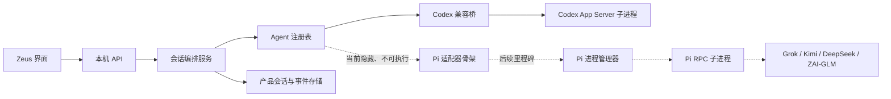

# Zeus 多运行内核公共框架开发设计

## 结论

Zeus 不把 Codex、Pi、Grok、Kimi、DeepSeek 和 GLM 当成同一层能力。

- Codex 是 Zeus 当前的原生 Agent，继续通过 Codex App Server 工作。
- Pi 是另一套独立 Agent，未来承载 Grok、Kimi、DeepSeek、ZAI/GLM 等模型供应源。
- Pi 与 Codex 在产品中明确区分，不宣称执行方式或官方体验相同。
- Pi 采用独立子进程，不能因为 Pi 故障拖垮 Zeus 执行宿主或 Codex 会话。
- 当前里程碑只搭公共框架，不接真实 Pi 模型，不启动 Pi 进程，普通用户默认看不到 Pi 入口。

这份文档是开发设计，不是实现完成记录。当前没有新增 Pi 依赖、没有配置任何模型密钥、没有运行 Pi 会话，也不能据此宣称 Zeus 已支持
Grok、Kimi、DeepSeek 或 GLM。

## 已确认的产品决策

### 两套 Agent 明确区分

Codex 与 Pi 可以共用 Zeus 的会话列表、消息主干和输入区，但必须显示真实 Agent 身份。未来通过 Pi 使用 Kimi 时，界面表达为“Pi
Agent · Kimi”，不能简称“Kimi Agent”。

优点：用户能够理解实际执行方式，问题归因和能力说明更可信。

缺点：同一模型未来可能同时存在 Pi 接入和官方 Agent 接入，产品需要解释两者差异。

### Pi 独立运行

Pi 未来通过远程控制模式（RPC）作为独立子进程运行。这里的 RPC 是“Zeus 与 Pi 进程之间交换结构化命令和事件的本机协议”。它不是模型接口，也不改变
Pi 自己的工具循环。

优点：Pi 崩溃、内存异常或依赖升级不会直接带走数据库写入者与 Codex Agent；也能复用 Zeus 已有的运行时世代与排空思路。

缺点：Pi 的 RPC 以当前会话为中心，并发会话需要多个工作进程或受控进程池，内存和进程管理成本高于同进程 SDK。

### 公共框架先行且默认隐藏

当前里程碑只完成公共类型、路由、数据迁移、能力判断和 Codex 兼容桥。Pi 只在内部目录中登记为 `framework_only`
，普通用户目录和模型选择器不返回它。

优点：可以先解除现有代码对 `codex_native` 的硬编码，同时不制造假功能。

缺点：公共抽象还没有经过真实 Pi 会话验证，接入第一家模型时允许根据证据调整接口。

## 术语

| 产品术语  | 含义                                          | 代码建议名                |
|-------|---------------------------------------------|----------------------|
| Agent | 一整套理解任务、调用工具、管理上下文和会话的工作方式，例如 Codex、Pi      | `agentKind`          |
| 模型供应源 | 提供模型推理能力的一方，例如 OpenAI、xAI、Kimi、DeepSeek、ZAI | `modelSourceId`      |
| 具体模型  | 模型供应源中的真实模型标识                               | `modelId`            |
| 原生会话  | Agent 自己保存的 thread 或 session                | `nativeSessionId`    |
| 产品会话  | Zeus 面向用户保存的稳定会话                            | `conversationId`     |
| 能力证据  | Zeus 对某项能力完成真实验证的记录                         | `capabilityEvidence` |
| 运行实例  | 一个真实运行中的 Codex App Server 或 Pi 子进程          | `runtimeInstanceId`  |

代码中不再使用一个 `provider` 同时表示 Agent、模型供应源和具体模型。现有 `provider_*` 字段保留为兼容字段，但不作为新设计的标准命名。

## 当前真实代码边界

| 位置                                                                | 当前事实                                                                                | 设计影响                                                  |
|-------------------------------------------------------------------|-------------------------------------------------------------------------------------|-------------------------------------------------------|
| `packages/ai-runtime/src/index.ts`                                | 非 Codex 路径是直接启动 Claude、Gemini 或 Generic CLI，只提供检测、提示、日志和停止等粗粒度能力                    | 不能把旧 CLI adapter 当成 Pi 公共框架                           |
| `packages/ai-runtime/src/codexAppServerManager.ts`                | 启动本机 `codex app-server` 并处理 thread、turn、事件和请求                                       | Codex 原生路径继续保留                                        |
| `packages/ai-runtime/src/codexRuntimeGenerationManager.ts`        | 管理多个 Codex 运行时世代，活动会话固定在原世代                                                         | 公共运行实例契约应吸收这一原则，但不能强迫 Pi 伪装成 Codex                    |
| `packages/local-server/src/codexNativeConversationCoordinator.ts` | 同时承担排队、幂等、恢复、Codex 协议映射和产品投影                                                        | 不能一次性重写；先增加兼容桥，再逐步抽取公共编排                              |
| `packages/storage/src/index.ts`                                   | `transport_kind` 只接受 `legacy_cli` 与 `codex_native`；thread、turn、item 均使用 provider 命名 | 必须采用增量迁移和双写，不能直接改列破坏历史会话                              |
| `packages/local-server/src/index.ts`                              | 会话写接口与能力接口大量判断 `codex_native`                                                       | 先增加统一路由，旧接口继续兼容                                       |
| `apps/desktop/src/renderer/session/*`                             | 会话状态、模型弹窗、服务档位和权限控件以 Codex 能力为默认                                                    | 公共框架只增加数据判断，不提前显示 Pi 控件                               |
| `apps/desktop/src/main/executionHost.ts`                          | Local Server、数据库和 Codex 管理由独立执行宿主持有                                                 | Pi 进程未来必须由同一执行宿主管理，而不是由 Renderer 或 Electron Main 直接启动 |

## 目标架构



完整视觉架构图见 `docs/diagrams/Zeus多运行内核架构图.html`。该图表达目标分层；本设计文档进一步限定当前只实现实线中的公共框架与
Codex 兼容路径。

## 模块职责

### Agent 注册表

Agent 注册表负责回答三个问题：有哪些 Agent、当前是否可用、哪些能力已经得到真实验证。它不能根据模型名称猜能力，也不能因为代码中存在一个适配器类就把它暴露给用户。

建议新增：

- `packages/ai-runtime/src/agentRuntimeContracts.ts`
- `packages/ai-runtime/src/agentRuntimeRegistry.ts`
- `packages/ai-runtime/src/agentCapabilityCatalog.ts`

### 会话编排服务

会话编排服务负责 Zeus 产品层的共同规则：会话归属、幂等、排队、并发、未发送内容、恢复门禁、数据保存和事件广播。它不决定模型什么时候调用工具。

建议新增：

- `packages/local-server/src/agentConversationCoordinator.ts`
- `packages/local-server/src/codexConversationCoordinatorBridge.ts`

首期的 Codex 兼容桥直接委托现有 `codexNativeConversationCoordinator`，不在同一个变更中重写三千余行成熟逻辑。后续只有在
Codex 回归证据稳定后，才逐段把排队、幂等和公共投影移入会话编排服务。

### 协议驱动层

协议驱动层只负责与一个真实 Agent 进程通信：启动、恢复、发送、停止、读取状态和接收事件。

- Codex 驱动继续由 `CodexAppServerManager` 与 `CodexRuntimeGenerationManager` 提供。
- Pi 驱动未来由 `PiRpcProcess` 与 `PiRuntimeSupervisor` 提供。
- 两者都输出 Zeus 公共事件，但保留无法统一的原始能力和原始负载。

### 事件投影

事件投影是“把 Agent 事件保存成 Zeus 会话记录”的过程。公共事件只表达用户真正能看到的生命周期，不强求 Codex 和 Pi 的底层事件同名。

建议新增：

- `packages/local-server/src/agentConversationProjector.ts`
- `packages/local-server/src/codexEventNormalizer.ts`
- `packages/local-server/src/piEventNormalizer.ts`，当前只定义类型，不接真实进程

## 公共类型设计

```ts
export type AgentKind = 'codex' | 'pi' | 'claude';

export type AgentTransportKind = 'app_server' | 'rpc' | 'sdk';

export type AgentSupportStatus =
  | 'unavailable'
  | 'framework_only'
  | 'experimental'
  | 'verified';

export type AgentCapabilityState =
  | 'supported'
  | 'unsupported'
  | 'unverified';

export interface AgentCapabilityEvidence {
  state: AgentCapabilityState;
  checkedAt: string | null;
  adapterVersion: string | null;
  binaryVersion: string | null;
  reason: string;
}

export interface AgentDescriptor {
  kind: AgentKind;
  displayName: string;
  transport: AgentTransportKind;
  supportStatus: AgentSupportStatus;
  visibleToUsers: boolean;
  capabilities: Record<string, AgentCapabilityEvidence>;
}

export interface AgentModelIdentity {
  sourceId: string | null;
  modelId: string;
  displayName: string | null;
}

export interface AgentSessionIdentity {
  agentKind: AgentKind;
  nativeSessionId: string;
  nativeSessionPath: string | null;
  runtimeInstanceId: string;
}
```

能力状态使用三态而不是布尔值：

- `supported`：有当前版本和真实运行证据。
- `unsupported`：当前协议明确不支持。
- `unverified`：代码或文档看似存在，但 Zeus 尚未完成真实验收。

这样可以避免把“没有证据”误写成“支持”或“不支持”。

## 公共驱动契约

```ts
export interface AgentRuntimeDriver {
  readonly kind: AgentKind;

  probe(): Promise<AgentRuntimeProbe>;
  readCapabilities(): Promise<AgentDescriptor>;

  openSession(input: OpenAgentSessionInput): Promise<AgentSessionIdentity>;
  resumeSession(input: ResumeAgentSessionInput): Promise<AgentSessionIdentity>;
  startRun(input: StartAgentRunInput): Promise<AcceptedAgentRun>;
  steerRun(input: SteerAgentRunInput): Promise<AcceptedAgentRun>;
  followUp(input: FollowUpAgentRunInput): Promise<AcceptedAgentRun>;
  interruptRun(input: InterruptAgentRunInput): Promise<void>;
  respondToInteraction(input: RespondAgentInteractionInput): Promise<void>;
  readSession(input: ReadAgentSessionInput): Promise<AgentSessionSnapshot>;
  recover(): Promise<void>;
  close(input: { mode: 'handoff' | 'final' }): Promise<void>;
  subscribe(listener: (event: AgentRuntimeEvent) => void): () => void;
}
```

所有方法都存在，但调用前必须经过能力判断；不支持的方法返回稳定的 `ZEUS_AGENT_CAPABILITY_UNAVAILABLE`，不能静默降级成另一种行为。

这套契约不直接暴露 Codex 的 thread/turn 或 Pi 的 session tree。各 Agent 的原始数据保存在事件负载中，公共层只持有稳定身份和用户可见状态。

## 公共事件设计

| 公共事件                          | 用户可见含义           | Codex 来源示例                                 | Pi 来源示例                              |
|-------------------------------|------------------|--------------------------------------------|--------------------------------------|
| `agent.session.bound`         | 产品会话已绑定原生会话      | `thread/start` 或 `thread/resume`           | `get_state` 返回真实 sessionId           |
| `agent.run.started`           | 本次执行已经开始         | `turn/started`                             | `agent_start`                        |
| `agent.message.delta`         | 回答正在生成           | item delta                                 | `message_update.text_delta`          |
| `agent.message.completed`     | 一条消息已完成          | item completed                             | `message_end`                        |
| `agent.tool.proposed`         | Agent 准备调用工具     | 服务端审批或 item started                        | `tool_execution_start`，只表示准备，不代表已经执行 |
| `agent.tool.updated`          | 工具产生进度           | item delta                                 | `tool_execution_update`              |
| `agent.tool.completed`        | 工具执行结束           | item completed                             | `tool_execution_end`                 |
| `agent.interaction.requested` | 需要用户确认或输入        | command/file/permissions/user input/MCP 请求 | Pi 扩展发出的 `extension_ui_request`      |
| `agent.compaction.changed`    | Agent 正在整理长会话上下文 | Codex 原生事件或不可见                             | `compaction_start/end`               |
| `agent.retry.changed`         | Agent 正在自动重试     | Codex 原生错误与状态                              | `auto_retry_start/end`               |
| `agent.usage.updated`         | Token 或费用统计更新    | token usage                                | `get_session_stats`                  |
| `agent.run.settled`           | 本轮不会再自动继续        | turn completed                             | `agent_settled`                      |
| `agent.runtime.failed`        | 运行进程或协议失败        | app-server 断开                              | Pi 进程退出或 JSONL 失效                    |

Pi 的 `prompt` 响应 `success: true` 只表示请求被接受、排队或立即处理，不能当成任务完成。只有收到 `agent_settled`
并完成持久化后，Zeus 才能把执行收敛为完成状态。

Pi 的 RPC 事件通常没有统一事件 ID。Zeus 为一次 Pi 执行生成 `nativeRunId`，并用“运行实例 + 会话 + 本地顺序”关联事件；不得把这个
ID 冒充成 Pi session entry 的原生 ID。工具事件继续使用 Pi 提供的 `toolCallId`。

## Pi 独立进程设计

### 进程关系

- Pi 进程只由 Zeus 执行宿主创建和回收。
- Renderer、Electron Main 和 Telegram 都不能直接启动 Pi。
- 一个 Pi 工作进程同一时刻只绑定一个活动会话。
- 同时运行多个 Pi 会话时，进程管理器按并发上限创建多个工作进程。
- 工作进程只有在 `agent_settled`、持久状态已同步且没有待交互请求时才能被标记为空闲。
- 活动会话固定在创建它的进程实例；配置或二进制变化只影响新会话和明确恢复的空闲会话。

### 进程状态

```text
starting -> ready -> busy -> ready
    |         |       |
    |         |       +-> draining -> stopped
    |         +----------> draining -> stopped
    +--------------------> failed
```

- `starting`：进程已创建，尚未完成版本和状态探针。
- `ready`：协议可用且没有活动执行。
- `busy`：存在活动执行、自动重试、上下文整理或待处理消息。
- `draining`：不再接新会话，等待当前会话安全结束。
- `stopped`：正常退出。
- `failed`：进程退出、输出不符合协议或无法确认会话身份。

### 启动参数原则

未来真实接入时，Pi 应使用独立配置目录和独立会话目录，不默认读取用户全局 `~/.pi/agent`：

```text
PI_CODING_AGENT_DIR=<Zeus userData>/agent-runtimes/pi/config
PI_CODING_AGENT_SESSION_DIR=<Zeus userData>/agent-runtimes/pi/sessions
pi --mode rpc --no-approve --no-extensions -e <Zeus 安全扩展> ...
```

`--no-approve` 只表示不加载未经同意的项目 Pi 配置，不是安全沙箱。Zeus 安全扩展必须在工具真正执行前拦截 `tool_call`
，检查目录、命令和权限，并通过 Pi 的扩展交互协议把确认请求交回 Zeus。

首个真实 Pi 里程碑还应显式决定是否加载项目 `AGENTS.md` 等上下文文件。不能同时让 Pi 自动加载一套项目说明、Zeus
又注入另一套说明而不记录来源。

### 协议读取

- 严格按换行符 `LF` 分隔 JSON 记录。
- 不使用 Node `readline`，因为 Pi 官方协议明确不允许把 Unicode 行分隔符当成记录边界。
- 每个命令都带 Zeus 生成的请求 ID，用于关联响应。
- stdout 只接收 JSON 协议；stderr 单独进入脱敏诊断日志。
- 单条非法 JSON、未知响应类型和重复请求 ID 都进入协议错误，不继续猜测。

### 宿主崩溃恢复

Pi RPC 使用标准输入输出连接。执行宿主崩溃后，即使旧 Pi 进程仍存在，新宿主也不能仅凭 PID 重新接管原标准输入输出。

因此恢复规则是：

1. 保存最后确认的 Pi sessionId、sessionFile、运行实例和提交状态。
2. 新宿主发现无法验证的旧进程时标记为孤儿，不把它当作可继续连接的进程。
3. 不自动重发旧 prompt，避免重复执行文件写入或外部动作。
4. 用户明确恢复后，新建 Pi 进程并打开已持久化 session；如果无法确认上次执行是否完成，保持 `recovery_required` 并展示现场。

优点：不会自动重复有副作用的动作。

缺点：执行宿主本身崩溃时，Pi 长任务无法像正常界面退出那样无缝继续，必须走明确恢复。

## 数据设计

### 增量字段

现有字段不能直接删除。建议对 `conversations` 增加：

| 字段                       | 含义                           |
|--------------------------|------------------------------|
| `agent_kind`             | `codex`、`pi` 或后续 `claude`    |
| `agent_transport`        | `app_server`、`rpc` 或后续 `sdk` |
| `model_source_id`        | 模型供应源；不能由 Agent 名称自动推断       |
| `model_id`               | 实际模型标识                       |
| `native_session_id`      | Agent 原生会话 ID                |
| `native_session_path`    | 原生会话文件路径；没有则为空               |
| `capability_snapshot_id` | 创建或恢复会话时使用的能力证据快照            |

对 `conversation_turns` 增加 `agent_kind` 与 `native_run_id`；对 `conversation_items` 增加 `agent_kind` 与
`native_item_id`。新唯一索引使用 Agent 身份与原生身份的组合，不能继续假设不同 Agent 的 ID 永不冲突。

### 能力快照

建议新增 `agent_capability_snapshots`：

```text
id
agent_kind
transport_kind
support_status
adapter_version
binary_version
protocol_version
capabilities_json
evidence_json
checked_at
```

能力快照不保存密钥、完整命令输出或用户正文。它只保存“检查了什么、结果是什么、依据哪个版本”。

### 回填规则

- 现有 `codex_native` 会话回填为 `agent_kind=codex`、`agent_transport=app_server`。
- `provider_model` 复制到 `model_id`，但 `model_source_id` 保持空值；Codex 也可能连接不同模型供应方式，不能无证据写死为
  OpenAI。
- `provider_thread_id/path` 复制到 `native_session_id/path`。
- 旧 CLI 会话保持原样，只读展示时按历史记录解释，不推断成新的 Agent 会话。
- 首期继续双写新旧字段，所有读取点迁移完成前不删除旧字段和旧索引。

优点：历史 Codex 会话不需要一次性重写。

缺点：过渡期字段较多，Repository 必须防止新旧值不一致。

## 本机 API 设计

### Agent 目录

新增 `GET /api/agents`，默认只返回 `visibleToUsers=true` 且状态为 `verified` 的 Agent。当前结果只能包含真实可用的 Codex；Pi
的 `framework_only` 记录不返回给普通界面。

开发诊断需要查看完整目录时，只能在显式开发模式下通过受本机 token 保护的诊断接口读取，不能用普通查询参数绕过隐藏规则。

### 会话快照

在现有快照中增加：

```json
{
  "agent": {
    "kind": "codex",
    "transport": "app_server",
    "supportStatus": "verified",
    "capabilitySnapshotId": "..."
  },
  "model": {
    "sourceId": null,
    "id": "..."
  },
  "nativeSession": {
    "id": "...",
    "path": null
  }
}
```

过渡期保留现有 `provider` 对象，Renderer 优先读取新对象，缺失时才读取旧对象。兼容读取不能反向写回推断值。

### 写请求路由

新建会话请求未来接受 `agentKind`、`modelSourceId` 和 `modelId`。首期 `agentKind` 省略时仍选择 Codex；显式传 `pi` 时返回
`ZEUS_AGENT_NOT_AVAILABLE`，不能落入旧 CLI 路径或创建半绑定会话。

已有会话的继续、停止、确认和恢复全部根据该会话持久 `agentKind` 路由。请求体不能临时改 Agent，也不能在同一原生会话中把 Codex
换成 Pi。

## 界面设计

### 当前里程碑

- 会话页外观和 Codex 操作保持不变。
- 普通设置、任务推送弹窗、新对话输入区和模型选择器不显示 Pi。
- 会话类型改为读取 `agent`、`model` 和 `nativeSession`，但兼容旧快照。
- 所有 Codex 专有控件，例如服务档位，只在能力证据为 `supported` 时显示。
- 不增加“即将推出”的空入口、假模型列表或灰色 Pi 标签。

### 后续真实 Pi 入口

只有真实模型验收通过后，模型选择区才显示两层信息：先显示 Agent，再显示该 Agent 下已验证的模型供应源与模型。默认文案示例：

- `Codex Agent · gpt-...`
- `Pi Agent · Kimi · <真实模型 ID>`

Pi 不支持或尚未验证的 Codex 专有能力直接隐藏；影响用户理解的能力则显示不可用原因。例如没有经过验证的文件撤销能力时，不展示
Undo/Reapply，而不是放一个永远禁用的按钮。

## 安全设计

Pi 官方说明其项目信任不是沙箱，Pi 进程默认拥有启动用户的系统权限。因此，“Pi 能发出工具事件”不等于 Zeus 已拥有安全执行闭环。

未来开放 Pi 前必须满足：

1. Pi 使用 Zeus 独立配置目录，不自动继承用户全局扩展、包和凭据。
2. 模型密钥保存在 Keychain，只在启动目标 Pi 进程时注入最小环境变量，不写入日志、数据库或会话文件。
3. Zeus 安全扩展在 `tool_call` 阶段阻断或确认命令、写文件、删除、项目外访问和网络动作。
4. 文件路径使用真实路径、符号链接和项目根复验，不能只检查字符串前缀。
5. 等待确认时，Pi 会话与运行实例保持绑定；回答不能投递给另一个进程或会话。
6. 扩展错误必须按失败关闭处理：没有得到明确允许就阻止工具执行。
7. Pi 原始事件和 stderr 在进入持久层前脱敏。
8. 宿主恢复时不自动重发可能产生副作用的提交。

当前公共框架不启动 Pi，因此以上安全能力全部标记为 `unverified`。

## 实施顺序

### 阶段 A：公共术语与存储

1. 增加 Agent、模型供应源、能力证据和原生会话类型。
2. 增加数据库增量字段与能力快照表。
3. 回填现有 Codex 会话，保持旧字段双写。
4. Repository 增加一致性检查：同一记录的新旧身份冲突时拒绝写入并记录诊断。

完成标志：旧 Codex 数据可无损读取，新字段可在空库和历史库中稳定生成；未出现 Pi 会话。

### 阶段 B：统一路由与 Codex 兼容桥

1. 建立 Agent 注册表和公共会话编排入口。
2. Codex 兼容桥委托现有 Coordinator。
3. Local API 从硬编码 `codex_native` 逐步改为按持久 Agent 身份路由。
4. 保留现有 Codex API 和错误码，避免一次性破坏 Renderer。

完成标志：Codex 创建、继续、排队、停止、确认、恢复和归档行为没有发生产品级变化。

### 阶段 C：能力驱动的 API 与界面数据

1. 增加 Agent 目录与能力快照 API。
2. 会话快照增加 `agent/model/nativeSession`。
3. Renderer 使用公共能力选择器控制操作可见性。
4. Pi 登记为 `framework_only` 且 `visibleToUsers=false`。

完成标志：普通用户仍只看到真实 Codex；开发诊断能解释 Pi 为什么未开放。

### 阶段 D：Pi 协议骨架

1. 定义 Pi RPC 命令、响应、事件和严格 JSONL 读取类型。
2. 定义 Pi 运行实例、进程池和恢复接口，不启动真实 Pi。
3. 定义 Pi 事件到公共事件的映射表。
4. 所有 Pi 能力保持 `unverified`，所有写入口返回不可用。

完成标志：代码具备清晰扩展点，但没有 Pi 包依赖、进程、凭据、模型调用或用户入口。

### 后续里程碑：首个真实模型

不属于当前范围。后续必须选择一家模型供应源完成真实纵向验收，再决定是否复制到其余模型。第一家模型接入时允许根据真实 Pi
协议与安全表现修改公共框架，不把当前抽象视为不可改变。

## 文件级改造清单

### 新增

- `packages/ai-runtime/src/agentRuntimeContracts.ts`
- `packages/ai-runtime/src/agentCapabilityCatalog.ts`
- `packages/ai-runtime/src/agentRuntimeRegistry.ts`
- `packages/ai-runtime/src/piRpcProtocol.ts`
- `packages/local-server/src/agentConversationCoordinator.ts`
- `packages/local-server/src/codexConversationCoordinatorBridge.ts`
- `packages/local-server/src/agentConversationProjector.ts`
- `packages/local-server/src/codexEventNormalizer.ts`
- `packages/local-server/src/piEventNormalizer.ts`

### 修改

- `packages/ai-runtime/src/index.ts`：导出公共契约；旧 CLI adapter 保持兼容。
- `packages/storage/src/index.ts`：增加增量迁移、公共身份和能力快照 Repository。
- `packages/local-server/src/index.ts`：注册 Agent 目录、公共路由和兼容输出。
- `packages/local-server/src/codexNativeConversationCoordinator.ts`：首期只接兼容桥，不做大规模重写。
- `apps/desktop/src/renderer/session/sessionTypes.ts`：增加公共 Agent、模型和原生会话快照。
- `apps/desktop/src/renderer/session/sessionSelectors.ts`：集中能力判断。
- `apps/desktop/src/renderer/App.tsx`：只消费公共目录，不展示隐藏 Agent。

### 当前不得新增

- Pi npm 依赖或内置二进制。
- Pi 模型密钥与 Keychain account。
- Pi 真实进程启动代码。
- Grok、Kimi、DeepSeek、GLM 的模型目录和 UI 入口。
- 模拟 Pi 回复、模拟能力或演示会话数据。
- 单元测试、组件测试、Vitest 配置或相关脚本。

## 验收标准

### 静态与构建

- `pnpm lint`
- `pnpm typecheck`
- `pnpm build`
- `pnpm package:mac`

这些命令只证明对应检查或构建成功，不等于真实运行验收完成。

### 数据迁移

- 使用真实历史数据库副本打开应用，确认 Codex 会话数量、thread、turn、item、提交和待交互请求没有丢失。
- 新旧字段冲突时必须失败并保留诊断，不能静默选择一边。
- 导出或日志中不出现新增密钥字段。

### Codex 回归

- 正式构建包中完成新建项目对话、任务推送、连续消息、排队、停止、命令或文件确认、用户提问、归档与恢复。
- 核对同一会话的产品身份、Codex thread 身份和执行目录没有变化。
- 核对服务档位、模型、推理强度和权限仍来自真实 Codex 能力。

### 隐藏框架

- 普通 `GET /api/agents` 不返回 Pi。
- 普通设置、任务推送和新对话入口不出现 Pi 或四家模型。
- 显式提交 `agentKind=pi` 返回稳定不可用错误，不创建 conversation、submission 或原生会话残留。
- 开发诊断能够显示 `Pi / framework_only / visibleToUsers=false` 及未开放原因。

### 尚未验收

- Pi CLI 安装与版本。
- Pi RPC 真实命令和事件往返。
- 任一模型供应源的认证、模型目录、费用或额度。
- Pi 文件读取、修改、命令执行、确认、停止和恢复。
- Pi 正式包端到端运行。

## 风险与取舍

### 公共框架过早抽象

风险：没有真实 Pi 证据时，接口可能只是在重新包装 Codex。

处理：首期保留 Codex 兼容桥，不强行改写现有 Coordinator；Pi 第一家真实接入允许调整公共契约。

### 存储双写不一致

风险：新旧字段长期并存可能产生冲突。

处理：Repository 集中双写、集中校验；业务代码不能分别更新两套字段。

### 能力目录被当成功能开关

风险：开发人员可能把 `framework_only` 改成可见就绕过真实验收。

处理：用户可见条件同时要求 `visibleToUsers=true`、`supportStatus=verified` 和关键能力证据为 `supported`。

### Pi 的安全能力被高估

风险：Pi 的项目信任或工具事件被误认为沙箱和审批。

处理：设计明确要求 Zeus 安全扩展、进程隔离和真实验收；在此之前所有 Pi 写能力均为未验证。

### 两套 Agent 增加维护成本

风险：事件映射、恢复、界面和版本兼容都要维护两套证据。

收益：Codex 保留原生体验，Zeus 同时获得多模型扩展路径；模型供应源不需要各自重写一套 Agent。

## 资料依据

- [Pi RPC 文档](https://pi.dev/docs/latest/rpc)
- [Pi SDK 文档](https://pi.dev/docs/latest/sdk)
- [Pi 会话格式](https://pi.dev/docs/latest/session-format)
- [Pi 设置与项目信任](https://pi.dev/docs/latest/settings)
- [Pi 安全说明](https://pi.dev/docs/latest/security)
- [Pi 扩展与工具拦截](https://pi.dev/docs/latest/extensions)
- [Pi 环境变量](https://pi.dev/docs/latest/environment-variables)
- [Codex App Server 官方说明](https://learn.chatgpt.com/docs/app-server)
- `docs/TASK_20260803_003_PI与ClaudeCodeSDK技术选型评价.md`
- `docs/adr/0004-多运行内核采用原生适配器与能力驱动界面.md`
- `docs/diagrams/Zeus多运行内核架构图.html`

## 本次交付边界

- 已完成：需求澄清、领域词确认、当前代码核验、官方协议核验、公共框架开发设计，以及第一批公共框架代码。
- 已实现：Agent 公共身份与驱动契约、三态能力目录、默认隐藏的 Pi 登记、Pi RPC 严格换行解码骨架、数据库增量字段与 Codex
  双写、能力快照仓储、公开 Agent 目录、开发模式诊断目录、会话兼容快照、Renderer 类型和 Pi 写入前门禁。
- 未实现：公共 Coordinator 对现有 Codex Coordinator 的完整桥接、公共事件投影器、Pi 进程管理、Pi 安全扩展、真实模型认证与调用。
- 未验收：真实历史数据库副本迁移、正式构建包中的 Codex 全链路回归和 Pi 真实协议往返。

## 2026-08-03 开发记录

### 已落地文件

- `packages/ai-runtime/src/agentRuntimeContracts.ts`
- `packages/ai-runtime/src/agentCapabilityCatalog.ts`
- `packages/ai-runtime/src/agentRuntimeRegistry.ts`
- `packages/ai-runtime/src/piRpcProtocol.ts`
- `packages/ai-runtime/src/index.ts`
- `packages/storage/src/index.ts`
- `packages/local-server/src/index.ts`
- `apps/desktop/src/renderer/apiClient.ts`
- `apps/desktop/src/renderer/session/sessionTypes.ts`
- `apps/desktop/src/renderer/session/sessionSelectors.ts`

### 实际行为

- 普通 `GET /api/agents` 同时要求 Agent 可见、状态已验证且基础会话能力有支持证据，因此 Pi 不会被普通界面读到。
- `GET /api/developer/agents` 只有开启开发者模式后才返回完整目录，可看到 Pi 为 `framework_only`、默认隐藏且所有已登记能力均未验证。
- 新建项目会话、新建或恢复任务会话，以及已有会话继续发送时，显式 `agentKind=pi` 或 `agentKind=claude` 会在写入幂等记录、conversation
  或 submission 前返回 `ZEUS_AGENT_NOT_AVAILABLE`。
- 现有 Codex 原生会话在数据库中继续保留 `provider_*` 字段，同时双写 `agent_kind=codex`、`agent_transport=app_server`、
  `model_id` 与原生会话身份。
- 历史 CLI 会话不回填 Agent 或模型供应源，避免无证据猜测。

### 已完成的运行检查

- AI Runtime、Storage 和 Local Server 包可独立编译。
- 临时 SQLite 数据库已真实执行建库、Codex 会话创建与绑定、turn/item 双写和能力快照写入；读回结果中的 Agent、模型和原生身份一致。
- 本机已安装 Codex CLI 的场景下，公开目录在真实完成 App Server 初始化并读到 7 个模型后返回 `codex / verified`；关闭 Codex
  原生能力时返回空目录。这里的 `verified` 不再只依赖命令存在或 `--help` 探针。
- 开启开发者模式后，诊断目录返回 `codex / unavailable / visible` 与 `pi / framework_only / hidden`，用于解释隐藏原因；该结果不会进入普通
  Agent 目录。
- 显式提交 `agentKind=pi` 返回 HTTP 409、错误码 `ZEUS_AGENT_NOT_AVAILABLE`，随后查询项目会话总数仍为 0。
- Pi RPC 解码骨架已用跨 UTF-8 分片的两条真实字节流记录检查，能完整读出中文消息与 `agent_settled`，且未启动 Pi 进程。
- `pnpm lint`、`pnpm typecheck`、`pnpm build` 与 `pnpm package:mac` 已通过。
- 打包产物为 `dist/Zeus-0.1.12-arm64.dmg` 和对应 blockmap；`codesign --verify --deep --strict` 通过，DMG 可被
  `hdiutil imageinfo` 正常识别。
- 本次包仍是临时签名且未公证，只能作为开发验收包；没有启动正式包完成 Codex 界面全链路回归。

### 当前取舍

本次没有为了“看起来完整”而新建空的公共 Coordinator、事件投影器和 Pi 进程管理器。优点是现有 Codex 执行主链没有被一次性重写；缺点是部分
Local API 仍按 `codex_native` 判断，下一阶段需要在真实 Pi 接入前逐步改成按持久 Agent 身份路由。
