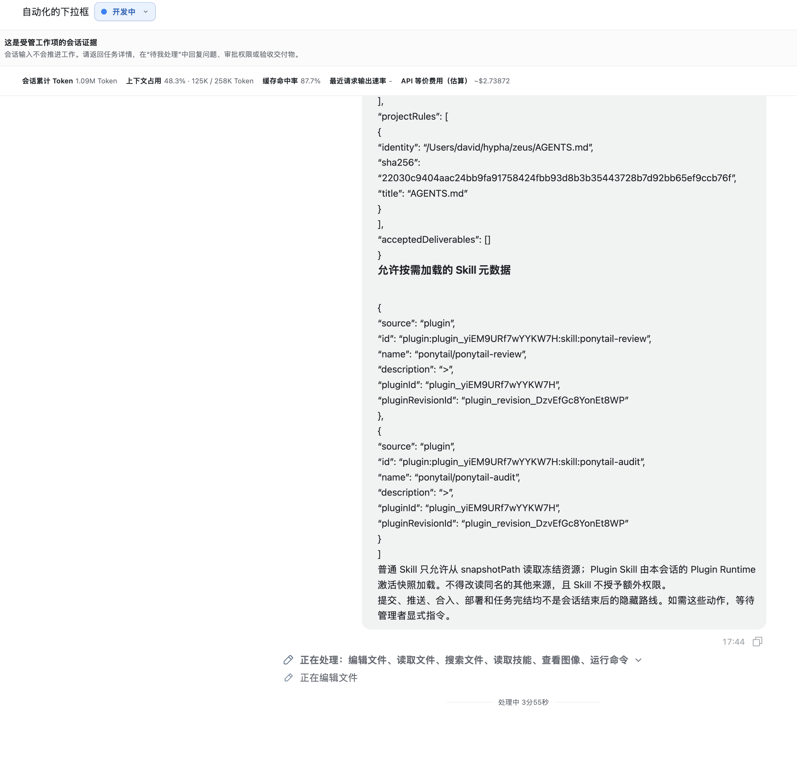

# ZEUS-0423 数字员工审批不可见与会话门禁死锁

## 当前阶段

已完成用户现场截图、当前源码和本机权威数据的只读诊断，并按确认方向完成实现：数字员工 Agent 运行不再拥有独立或“受管”的会话类型，完全复用普通任务推送会话。静态检查、完整构建和独立测试身份打包均已通过；真实 GUI 因另一个 worktree 的同测试身份实例正在运行而按隔离护栏暂停。当前已进入用户授权的本地 `main` 合入阶段；不修改正式数据，也不向远端推送。

## 产品方向确认

- 数字员工 Agent 运行通过统一任务推送创建普通任务会话；普通消息、补充信息、审批、排队、恢复、归档和历史展示全部复用既有会话方案。
- 工作运行只冻结员工、模型、Skill、权限和上下文配置，并关联 `conversationId`；它不拥有、复制或改写会话交互。
- 工作项继续负责运行重试、停止、未知结果、正式交付物、验收和返工。这些是工作管理事实，不是新的会话类型。
- 任务详情可以聚合会话待处理请求，但必须展示并响应同一条原始请求，不再复制为第二份 `task_work_decisions` 待办。
- 正式交付物一旦提交即冻结版本；之后的普通会话轮次不得静默改写该版本。需要产生新交付物时，通过显式返工创建新运行和新版本。

## 实现结果（2026-09-01）

- 会话列表投影不再查询或返回 `managedByTaskWorkItem`，工作项关联不会改变普通任务会话的 `readOnly` 或 `resumable`。
- 会话消息派发不再因 `task_work_runs.conversation_id` 关联返回 `ZEUS_TASK_WORK_CONVERSATION_MANAGED`；任务终态、归档和正式只读验证门禁仍保持原有行为。
- Agent 等待补充信息或审批时不再创建 `input_required / authorization` 工作管理待办；任务详情直接聚合原始 `conversation_server_requests` 身份，并提供“打开任务会话”入口。
- 工作管理投影不再展示历史遗留的会话交互副本，但继续展示交付物验收、命令确认、命令失败和未知结果处置。
- 会话请求结束后，工作运行和工作项可从 `waiting_input / waiting_manager` 恢复为 `active`；正式交付物提交后，运行保持 `runtime_completed`，后续普通会话轮次不回写冻结交付物。
- 任务详情移除了会话问题和审批的第二套表单；工作项入口改为“打开会话”，会话仍可作为审计引用，但不再被描述为只读证据类型。

## 验证记录（2026-09-01）

- `pnpm lint`：通过。
- `pnpm typecheck`：通过，其中架构治理确认 126 张 Core 表和 11 张可重建辅助表均保持单一所有者。
- `pnpm build`：通过；仅出现第三方 `markstream-react` 的既有 Rolldown `INVALID_ANNOTATION` 与大 chunk 告警。
- `pnpm package:mac`：通过，生成 `dist/test/mac-arm64/Zeus Test.app`；bundle ID 为 `dev.hypha.zeus.test`，深度签名校验通过。
- 正式数据库只读复核：按新投影规则，任务“自动化的下拉框”的 8 条历史 `authorization / pending` 副本不会再进入“待我处理”；真正的 `deliverable_acceptance` 待办继续保留。未写入正式数据库。
- 显示器现场：主外接屏 ID 5、内建屏 ID 1、非主外接屏 ID 3；测试包已具备通过 `ZEUS_TEST_DISPLAY_ID=3` 从首次创建起落在非主外接屏的条件。
- GUI 验收缺口：`/Users/david/hypha/zeus/dist/test/mac-arm64/Zeus Test.app` 的另一测试实例仍在运行。本任务没有关闭、复用或接管该实例，也没有启动自己的测试包；待测试身份释放后，仍需用全新 `ZEUS_USER_DATA_DIR` 完成“任务待办 → 打开会话 → 原始审批可见且输入可用”的真实交互检查。

## 修复前用户可见现状

截图中：

1. 顶部宣告“会话输入不会推进工作”，却没有在当前会话显示已经发生的审批。
2. 时间线底部仍显示“正在处理 / 正在编辑文件”，用户无法从当前屏幕判断 Agent 已等待批准。
3. 当前可见范围内没有审批卡片、审批按钮或指向具体待办的操作入口。

## 修复前代码根因

### 1. 只读门禁同时隐藏了审批面板

`ConversationChoiceQueryApplication` 只要发现任何 `task_work_runs.conversation_id` 关联就将会话设为 `readOnly` 和 `managedByTaskWorkItem`，不区分工作运行状态。渲染层把该值传为 `suppressComposer`。

`SessionWorkspace.renderBlockingInteraction()` 的第一个分支在 `suppressComposer` 为真时直接返回 `null`，因此原本已有的 `PendingRequestSurface` 审批卡片也一起被隐藏。“禁止自由输入”被错误扩大为“禁止显示和处置待办交互”。

### 2. 会话请求与管理者待办没有双向收敛

`taskWorkManagement` 每 2.5 秒轮询可恢复运行，根据会话 `stage/providerState` 再为 `conversation_server_requests` 创建 `task_work_decisions`。这是原始请求之后的二次投影，而非同一个交互身份的直接呈现。

当原始会话请求从其他路径已经 `resolved`时，修复前实现不会自动解决或驳回对应的 `task_work_decision`。这会产生过期待办，并使工作项、工作运行与会话状态相互矛盾。

### 3. 状态回退只更新运行，不修正工作项

`processAgentRun()` 在检测到等待时会把运行设为 `waiting_input`、工作项设为 `waiting_manager`。如果会话之后回到非等待阶段，代码只把运行恢复为 `active`，不会把工作项从 `waiting_manager` 恢复为 `active`。

## 本机只读现场（2026-08-31）

对 `/Users/david/.zeus/data/zeus.db` 仅执行只读查询，没有更改正式数据。任务“自动化的下拉框”的当前权威现场为：

- 工作项：`waiting_manager`；
- 当前运行：`waiting_input`；
- 会话：`provider_state=waiting / stage=waiting_approval`；
- 当前存在一条 `command` 原始审批请求，状态为 `pending`，且已创建匹配的 `authorization` 管理者待办；
- 同一工作项还有两条原始请求已经 `resolved`，但对应的 `authorization` 管理者待办仍为 `pending`；
- 该任务当前共有 4 条 `pending` 管理者待办，其中包含过期的审批和历史失败运行的验收待办。

## 产品结论

“会话只读，待办统一在任务详情处理”只有在待办投影实时、唯一、可见、可达且与原始请求同生共死时才能成立。当前五个条件均未完整满足，因此不能再把这种交互称为“有产品依据的只读设计”。

在完全复用普通任务会话的方向下，最小可行改造为：

1. 删除由 `managedByTaskWorkItem` 派生的会话只读与消息拒绝逻辑；当前会话按普通任务会话规则输入、恢复和处置审批。
2. 会话页和任务页共用同一条请求身份和同一个响应命令；任一入口处置后，两处立即同步。
3. 不再为原始请求创建关联的工作管理待办；任务详情仅聚合同一请求身份，并从当前实际请求重算工作项和运行状态。
4. 删除“受管工作项会话证据”横幅；数字员工身份和工作项状态作为普通会话的上下文信息展示，不改变交互能力。

### 取舍

- 会话内显示结构化审批的优点是消除死锁、保留上下文，且可直接复用已有审批组件；缺点是会话页和任务页成为两个操作面，必须强制共用同一响应命令与幂等身份。
- 改为原始请求事件驱动的优点是可消除轮询窗口和过期待办；缺点是恢复时必须增加一次幂等重放与全量收敛，不能只依赖实时事件。

## 证据边界

- 截图能确认当前可见屏幕上无审批操作，但不能单独证明键盘、读屏器或所有响应式尺寸下的表现。
- 本轮未操作正式 Zeus GUI，未点击审批，也未修改任何正式数据。
- 当前结论由用户提供截图、当前源码调用链和本机权威数据只读现场共同支持。
